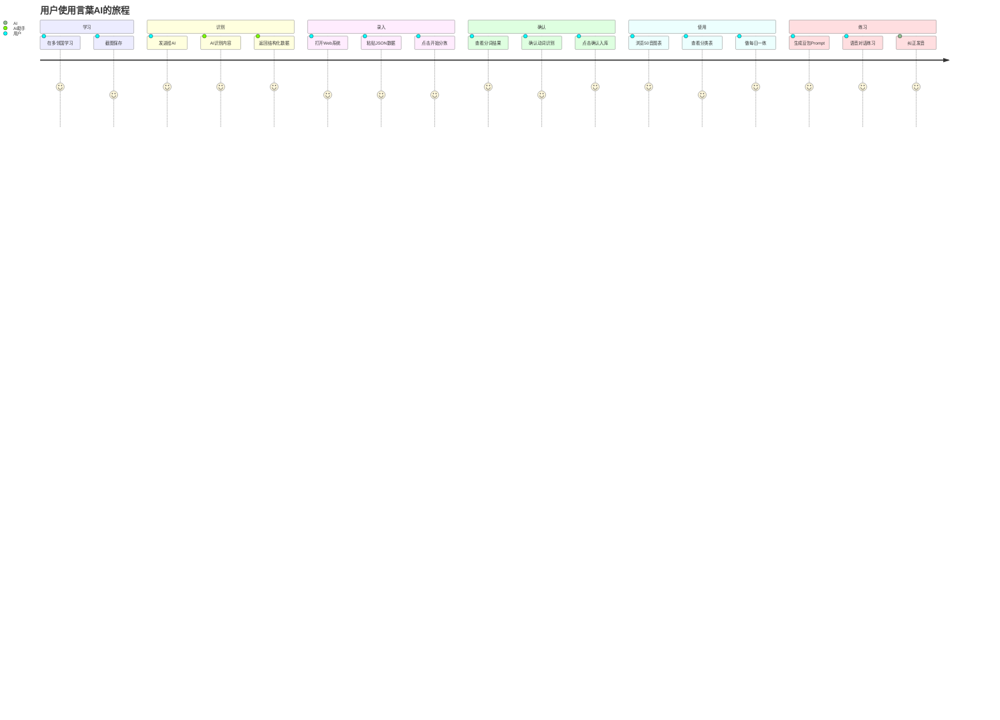
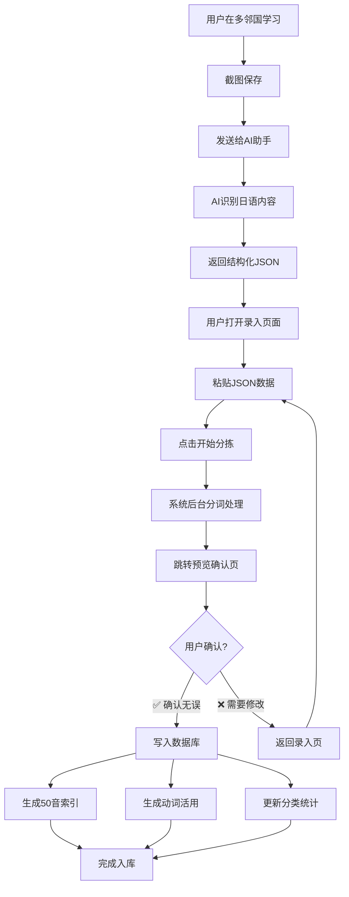
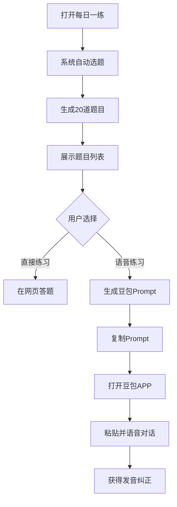

# 01-用户需求文档

> 言葉AI (Kotoba AI) 需求分析与方案选择

---

## 1.1 原始需求记录

### 用户原话

> "我在多邻国学习日语，每天都会学到一些新的单词和句子，发音和语法。但是我觉得多邻国的练习内容不够系统，也不够量，所以我有一个思路，把每天学习到的新的都记录下来，放到一个系统里面。
>
> 这个系统会接收我每天新学习的内容，为了方便，我将以截图形式上传，ai 助手会识别图片，把里面的日语识别出来，然后存库，存的包括日语原文，平假名，罗马音，中文意思。
>
> 另外还会有一个日语 50 音，平假名的，片假名的，会有一个页面，当我点击某个音的时候，会自动检索我已经学习积累过的单词和句子。
>
> 另外还会有一个名词积累表，动词积累表，形容词积累表，助词积累表，都会对我已经学习过的能索引。
>
> 这个系统还有一个非常重要的功能，输出一个"每日一练"，从我已经学过（我输入）的单词/句子里面出题，每天出 20 个题，比如考考我这个句子应该怎么说，出题应该有一个权重，最近学的多考，但也结合一下以前学过的，综合起来。
>
> 根据这个每日一练，还会生成一个 prompt，合在一起，我会复制给豆包app，利用它的语音识别功能（打电话）功能，请它每天一题一题的考我，纠正我的读音。"

---

## 1.2 需求分析

### 核心痛点

1. **碎片化学习**：多邻国内容零散，缺乏系统性
2. **复习困难**：学过就忘，没有有效的复习机制
3. **练习不足**：平台提供的练习量不够
4. **缺乏索引**：无法按发音、词性等维度检索已学内容
5. **语音练习**：需要口语练习和发音纠正

### 功能需求

| 编号 | 需求 | 优先级 | 描述 |
|------|------|--------|------|
| R1 | AI识别录入 | 高 | 截图→AI识别→结构化数据 |
| R2 | 数据存储 | 高 | 原文、平假名、罗马音、中文 |
| R3 | 50音检索 | 高 | 点击50音图表检索相关内容 |
| R4 | 分类表 | 高 | 名词/动词/形容词/助词表 |
| R5 | 动词活用 | 高 | 动词12种变形完整支持 |
| R6 | 每日一练 | 高 | 智能选题20题 |
| R7 | Prompt生成 | 中 | 生成豆包语音练习Prompt |
| R8 | 预览确认 | 高 | 录入后预览，确认再入库 |

### 非功能需求

- **轻量化**：本地运行，无需云端依赖
- **零成本**：无API调用费用
- **易用性**：操作简单，流程清晰
- **可扩展**：预留移动端和云端部署可能

---

## 1.3 方案对比与选择

### 数据库方案

| 方案 | 描述 | 优点 | 缺点 | 决策 |
|------|------|------|------|------|
| **SQLite** | 单文件关系型数据库 | 零配置、轻量、Python内置、支持JSON | 仅限本地、非高并发 | ✅ **选中** |
| MongoDB | 文档型数据库 | 灵活的JSON存储、查询强大 | 需安装服务、较重 | ❌ 舍弃 |
| PostgreSQL | 高级关系型数据库 | 功能完善、扩展性强 | 过重、需安装 | ❌ 舍弃 |

**选择理由**：个人学习数据量小，SQLite单文件即可满足，且支持JSON字段，备份简单（复制一个文件）。

### AI识别方案

| 方案 | 描述 | 优点 | 缺点 | 决策 |
|------|------|------|------|------|
| **外部AI (Opencode)** | 我帮用户识别 | 零成本、准确率高、可解释语法 | 需手动操作、非实时 | ✅ **选中** |
| OpenAI API | GPT-4V识别 | 自动化、快速 | 需API key、有费用 | ❌ 舍弃 |
| Tesseract.js | 开源OCR | 免费、本地运行 | 准确率一般、需训练 | ❌ 舍弃 |

**选择理由**：零成本、准确率高，且我可以提供额外的语法解释和学习建议。

### UI框架方案

| 方案 | 描述 | 优点 | 缺点 | 决策 |
|------|------|------|------|------|
| **DaisyUI** | Tailwind CSS组件库 | 美观、轻量、主题丰富 | 需CDN引入 | ✅ **选中** |
| 纯Tailwind | 手写样式 | 完全可控、无依赖 | 需自己设计组件 | ❌ 舍弃 |
| React+AntD | 前端框架+组件库 | 功能强大、生态丰富 | 过重、需构建 | ❌ 舍弃 |

**选择理由**：DaisyUI在保持轻量的同时提供美观的现成组件，完美契合"轻量但专业"的需求。

### 后端框架方案

| 方案 | 描述 | 优点 | 缺点 | 决策 |
|------|------|------|------|------|
| **Flask** | Python轻量框架 | 简单、灵活、文档丰富 | 功能较基础 | ✅ **选中** |
| FastAPI | 现代Python框架 | 异步、自动文档 | 学习成本略高 | ❌ 舍弃 |
| Django | 全功能框架 | 功能齐全、Admin强大 | 过重、约束多 | ❌ 舍弃 |

**选择理由**：Flask足够轻量，对于CRUD应用完全够用，且易于理解和维护。

---

## 1.4 最终方案确认

### 技术栈

```yaml
项目名: kotoba-ai (言葉AI)
后端: Python 3.8+ + Flask
数据库: SQLite 3.9+ (支持JSON)
前端: HTML5 + Vanilla JS + Tailwind CSS + DaisyUI
AI识别: 外部 (Opencode助手)
部署: 本地运行 (预留云端扩展)
```

### 核心设计决策

1. ✅ **SQLite单文件数据库**：轻量、零配置、支持JSON
2. ✅ **外部AI识别**：我帮识别，用户录入Web系统
3. ✅ **录入→预览→确认流程**：支持回滚，确保数据准确
4. ✅ **完整动词活用系统**：12种变形全支持
5. ✅ **50音自动索引**：点击即可检索
6. ✅ **智能每日一练**：权重算法，新学+复习结合

---

## 1.5 用户旅程地图



---

## 1.6 关键交互流程

### 流程1：内容录入与确认



### 流程2：50音检索


### 流程3：每日一练



---

## 1.7 预期效果

### 学习效果提升

- **系统性**：从碎片化到体系化，建立完整的知识网络
- **可检索**：通过50音、词性多维度检索，加强记忆
- **强化复习**：科学的复习算法，对抗遗忘曲线
- **口语练习**：结合豆包语音，提升发音和口语表达

### 使用体验

- **简单**：截图→识别→录入→确认，4步完成
- **直观**：50音图表、分类表清晰展示学习进度
- **智能**：自动分拣、自动出题，减少手动操作
- **灵活**：支持网页练习和语音练习两种模式

---

## 1.8 后续扩展可能

### 短期优化
- [ ] 暗黑模式支持
- [ ] 数据导出功能
- [ ] 学习统计图表
- [ ] 错题本功能

### 中期升级
- [ ] 部署到云端，支持手机录入
- [ ] 接入真正的OCR API，实现自动化识别
- [ ] 添加例句库和语法讲解
- [ ] 支持更多教材（不只是多邻国）

### 长期愿景
- [ ] 智能推荐学习路径
- [ ] 社区功能（共享学习资料）
- [ ] AI对话练习（集成到系统内）
- [ ] JLPT考级专项训练

---

**文档版本**: v1.0  
**创建日期**: 2026-02-11  
**最后更新**: 2026-02-11
