# 02-系统架构设计

> 言葉AI (Kotoba AI) 系统架构与数据流设计

---

## 2.1 整体架构

### 2.1.1 架构图

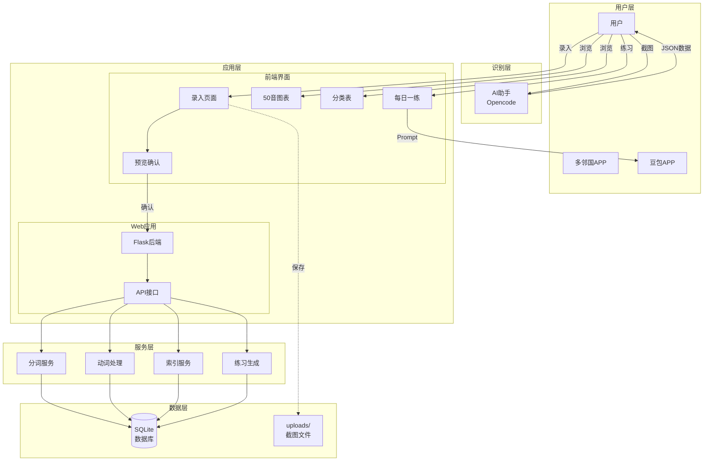

### 2.1.2 分层说明

| 层级 | 职责 | 组件 |
|------|------|------|
| **用户层** | 学习场景、数据入口 | 多邻国、用户、豆包APP |
| **识别层** | AI识别日语内容 | Opencode助手 |
| **应用层** | Web应用核心 | Flask后端 + 前端页面 |
| **服务层** | 业务逻辑处理 | 分词、动词、索引、练习生成 |
| **数据层** | 数据持久化 | SQLite数据库 + 文件存储 |

---

## 2.2 数据流设计

### 2.2.1 核心数据流

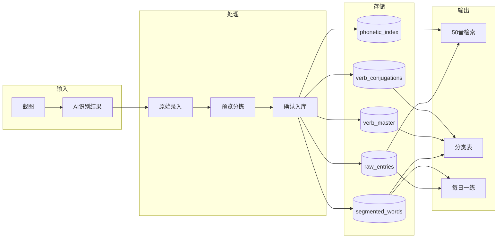

### 2.2.2 详细数据流说明

#### 流1：录入流程

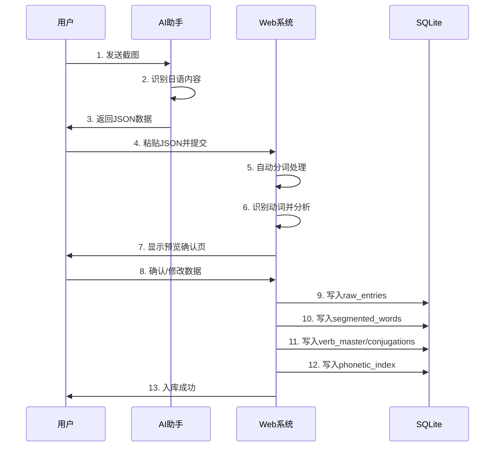

#### 流2：查询流程

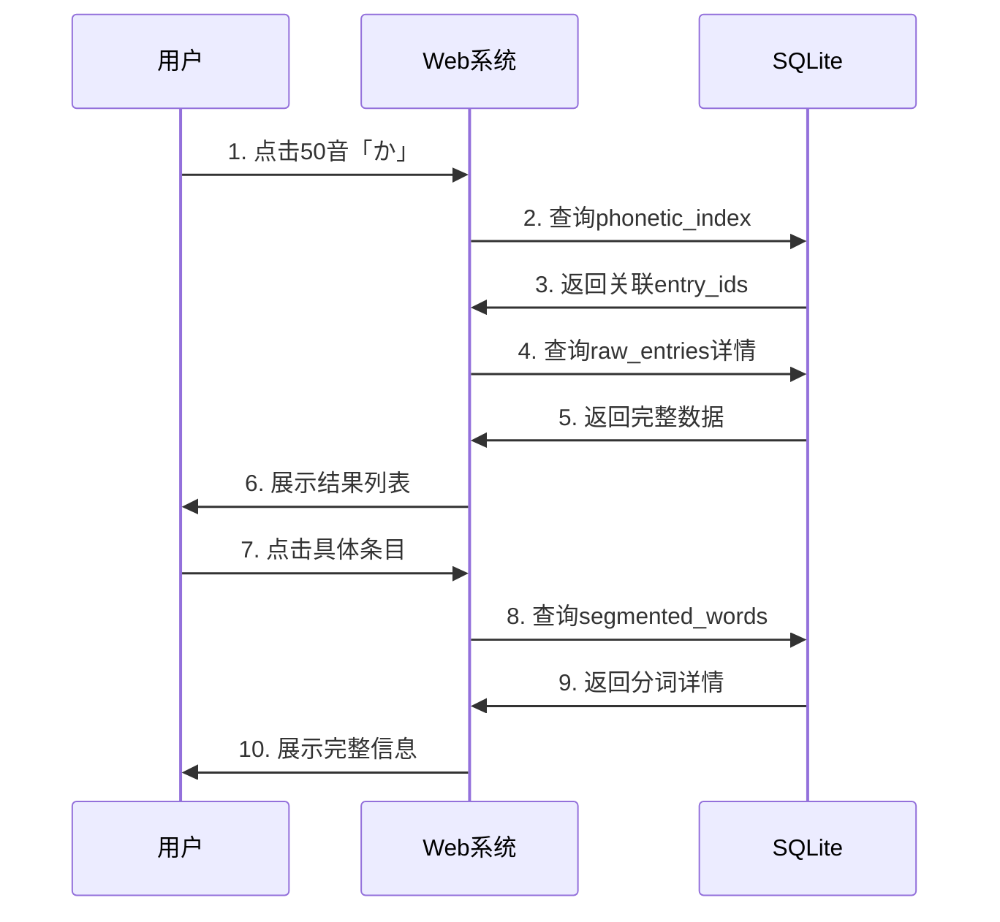

#### 流3：每日一练流程

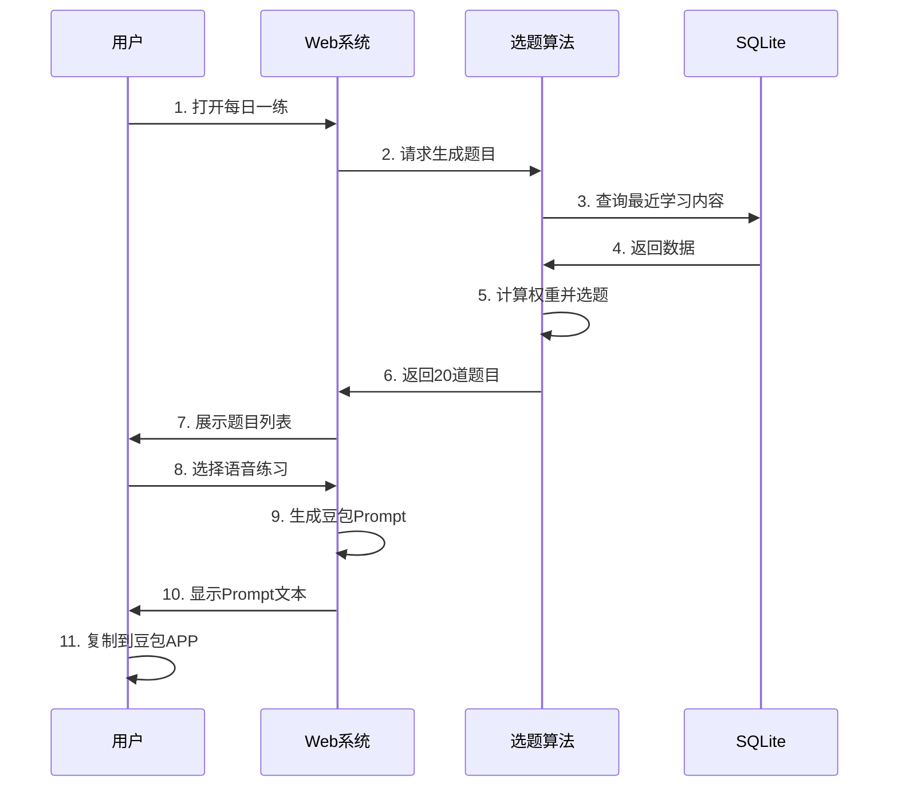

---

## 2.3 模块划分

### 2.3.1 模块结构图

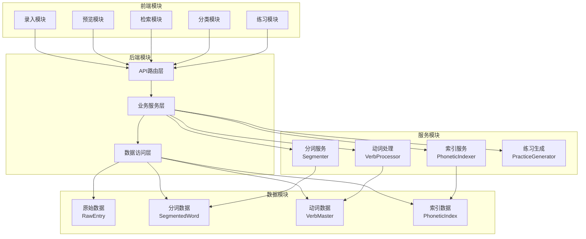

### 2.3.2 模块职责

| 模块 | 职责 | 关键功能 |
|------|------|----------|
| **录入模块** | 接收用户输入 | JSON解析、数据验证、提交预览 |
| **预览模块** | 展示分词结果 | 分词列表、动词编辑、确认/回滚 |
| **检索模块** | 50音图表检索 | 图表展示、点击检索、结果展示 |
| **分类模块** | 词性分类展示 | 名词/动词/形容词/助词表 |
| **练习模块** | 每日一练 | 选题生成、Prompt生成 |
| **API路由层** | HTTP接口 | RESTful路由、参数解析、响应封装 |
| **业务服务层** | 业务逻辑协调 | 调用服务、事务管理、数据组装 |
| **数据访问层** | 数据库操作 | CRUD、查询构建、连接管理 |
| **分词服务** | 自动分词 | 日文分词、词性标注、索引生成 |
| **动词处理** | 动词识别和活用 | 原型识别、变形分析、活用生成 |
| **索引服务** | 50音索引 | 假名提取、索引映射、查询优化 |
| **练习生成** | 智能选题 | 权重计算、随机选题、Prompt组装 |

---

## 2.4 技术架构决策

### 2.4.1 为什么选择Flask？

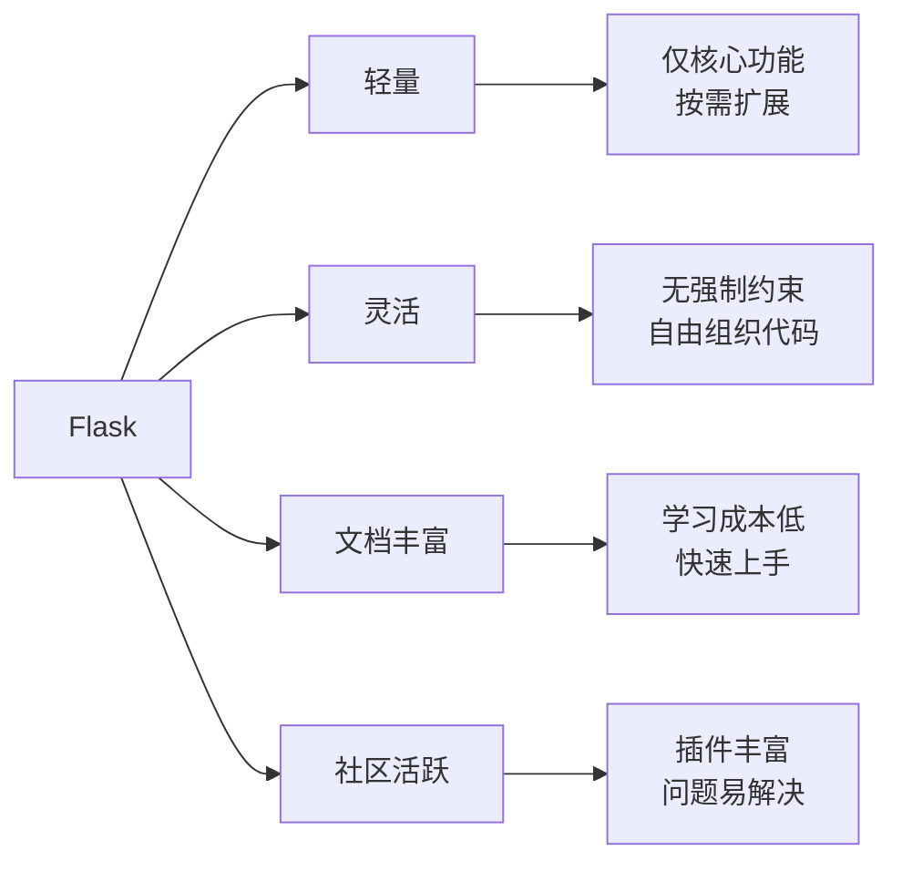

### 2.4.2 为什么选择SQLite？

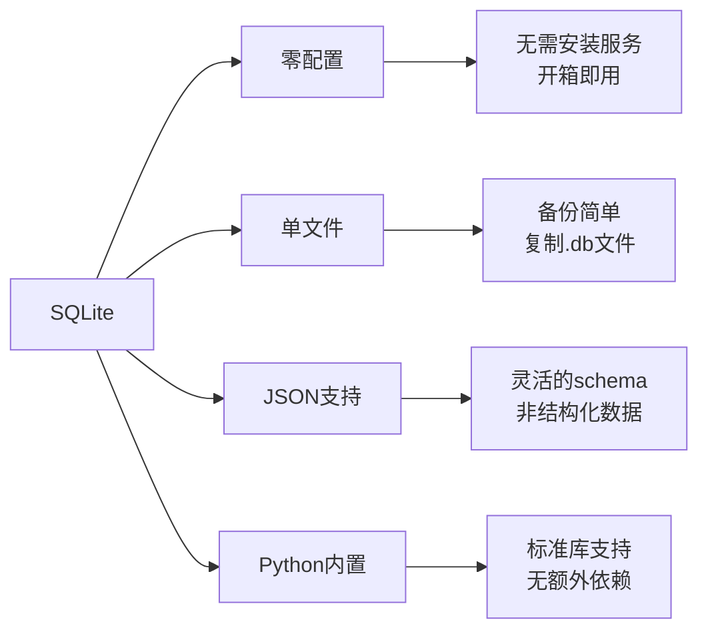

### 2.4.3 为什么选择DaisyUI？

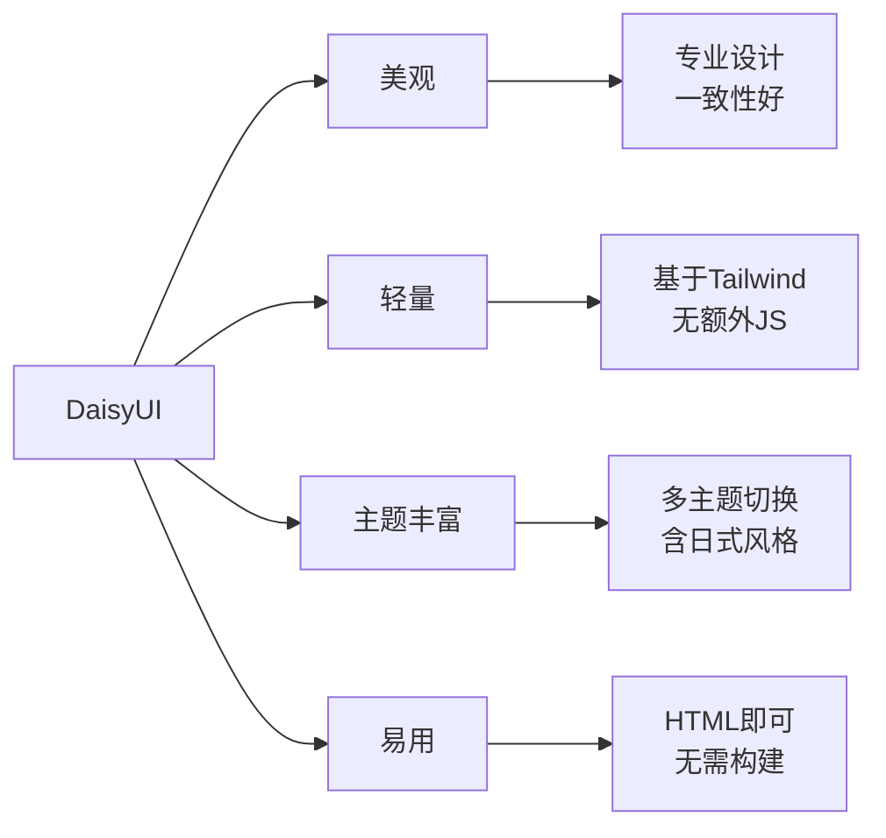

---

## 2.5 扩展性设计

### 2.5.1 预留云端部署接口

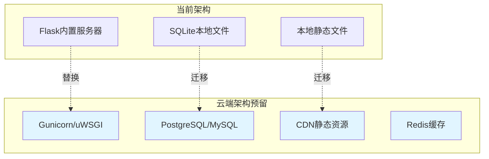

### 2.5.2 移动端兼容性预留

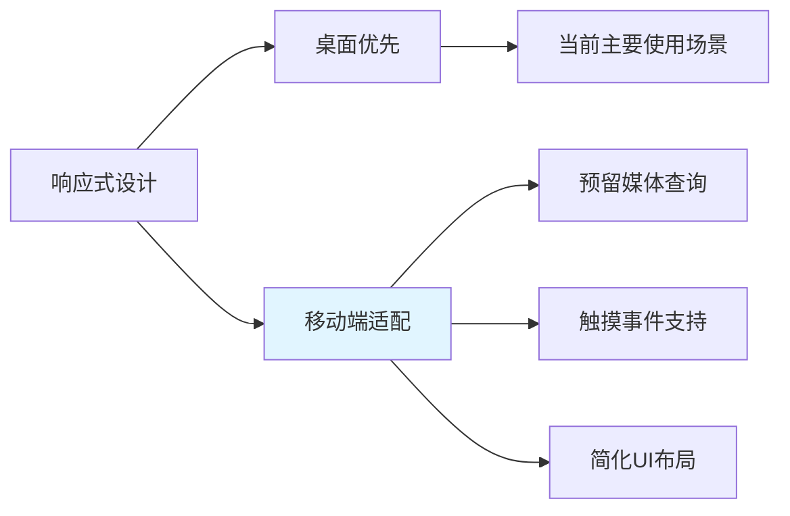

### 2.5.3 插件化设计

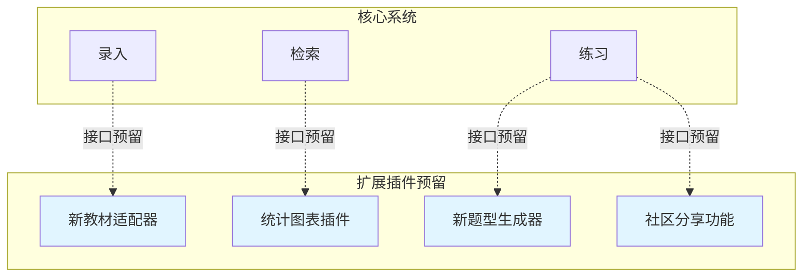

---

## 2.6 性能考虑

### 2.6.1 当前优化

| 优化点 | 策略 | 预期效果 |
|--------|------|----------|
| 数据库查询 | 合理索引 | <100ms查询 |
| 静态资源 | CDN引入DaisyUI | 快速加载 |
| 分词处理 | 异步处理 | 不阻塞UI |
| 数据分页 | 分页加载 | 流畅浏览 |

### 2.6.2 未来优化预留

- **缓存层**：Redis缓存热点数据
- **CDN**：静态资源CDN加速
- **数据库优化**：读写分离、连接池
- **前端优化**：懒加载、虚拟滚动

---

## 2.7 安全考虑

### 2.7.1 当前安全措施

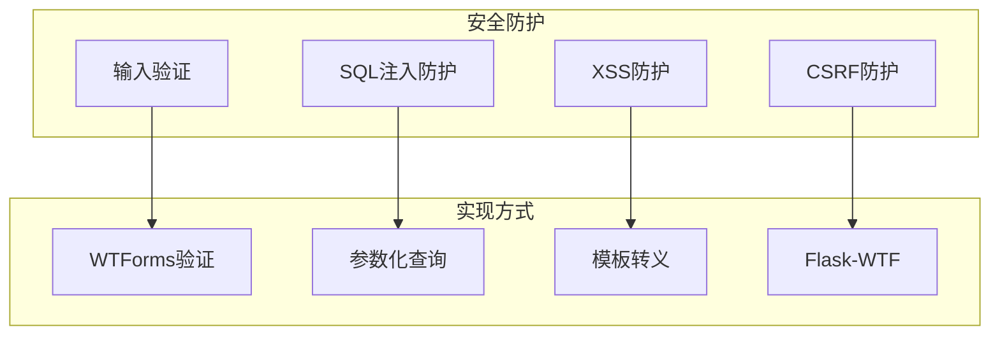

### 2.7.2 数据安全

- **本地存储**：数据仅存储在用户本地
- **无网络传输**：敏感数据不上传云端
- **定期备份**：脚本自动化备份数据库

---

**文档版本**: v1.0  
**创建日期**: 2026-02-11
