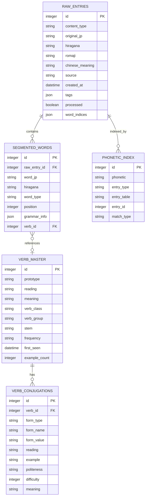
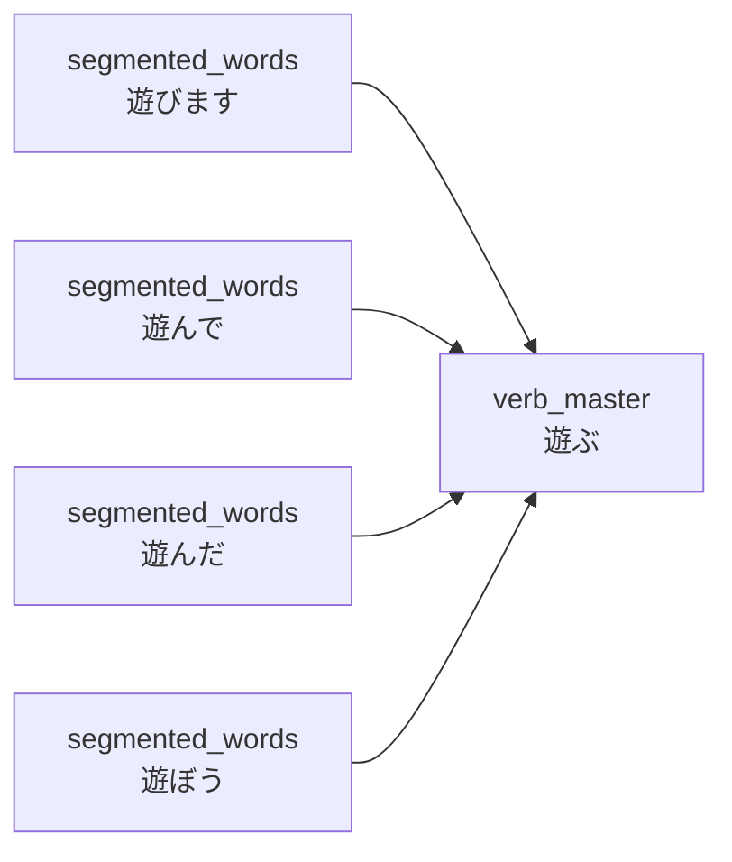
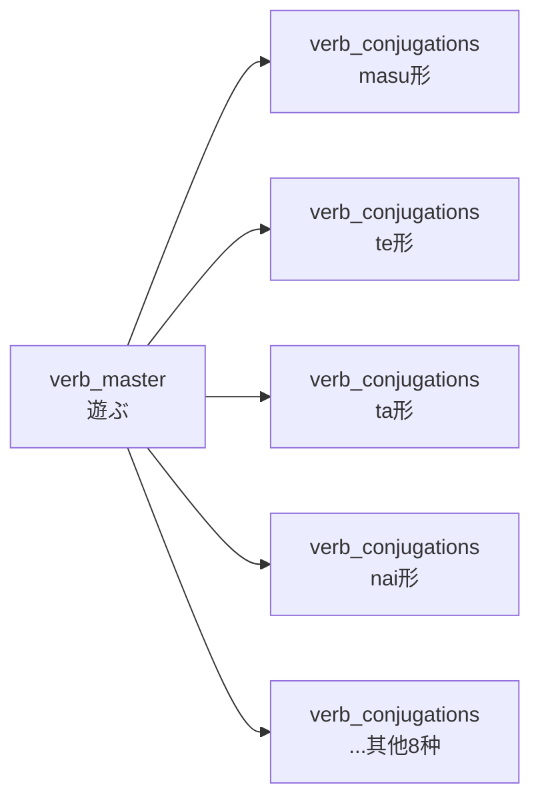
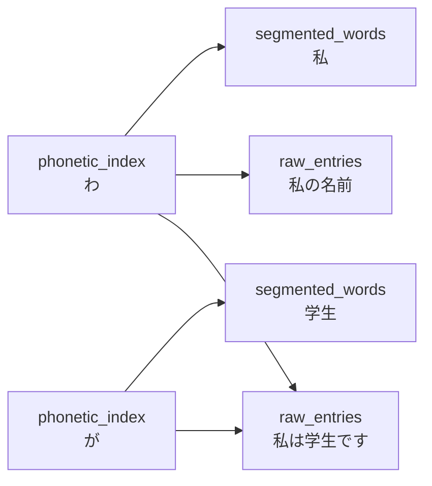

# 03-数据库设计

> 言葉AI (Kotoba AI) 数据库Schema设计

---

## 3.1 数据库选型

### 3.1.1 选择SQLite的理由

| 特性 | SQLite | MongoDB | PostgreSQL |
|------|--------|---------|------------|
| **部署难度** | ⭐ 零配置 | ⭐⭐ 需安装 | ⭐⭐⭐ 需配置 |
| **存储方式** | 单文件 | 服务+数据文件 | 服务+数据文件 |
| **备份方式** | 复制文件 | 导出/工具 | 导出/工具 |
| **JSON支持** | ✅ 原生支持 | ✅ 文档型 | ✅ JSONB类型 |
| **Python集成** | ✅ 标准库 | ⚠️ 需pymongo | ⚠️ 需psycopg2 |
| **适用场景** | 本地/轻量 | 大规模/分布式 | 企业级/复杂查询 |

**决策**：个人学习数据量小（预计<10万条），SQLite单文件完全够用，且支持JSON字段提供灵活性。

### 3.1.2 SQLite JSON功能

```sql
-- 创建含JSON字段的表
CREATE TABLE raw_entries (
    id INTEGER PRIMARY KEY AUTOINCREMENT,
    tags JSON,  -- 存储JSON对象
    created_at TIMESTAMP DEFAULT CURRENT_TIMESTAMP
);

-- 插入JSON数据
INSERT INTO raw_entries (tags) 
VALUES ('{"grammar": ["は助词"], "difficulty": 1}');

-- 查询JSON字段
SELECT * FROM raw_entries 
WHERE json_extract(tags, '$.difficulty') = 1;

-- 更新JSON字段
UPDATE raw_entries 
SET tags = json_set(tags, '$.difficulty', 2)
WHERE id = 1;
```

---

## 3.2 表结构设计

### 3.2.1 完整E-R关系图



### 3.2.2 表1：raw_entries（原始录入表）

存储用户从多邻国等学习的内容，是整个系统的核心数据源。

```sql
CREATE TABLE raw_entries (
    id INTEGER PRIMARY KEY AUTOINCREMENT,
    content_type TEXT NOT NULL CHECK(content_type IN ('sentence', 'word', 'phrase')),
    original_jp TEXT NOT NULL,              -- 日语原文
    hiragana TEXT NOT NULL,                 -- 平假名注音
    romaji TEXT,                            -- 罗马音
    chinese_meaning TEXT NOT NULL,          -- 中文意思
    source TEXT,                            -- 来源截图文件名
    created_at TIMESTAMP DEFAULT CURRENT_TIMESTAMP,  -- 录入时间 ⭐关键字段
    tags JSON,                              -- 扩展信息（语法点、场景等）
    processed BOOLEAN DEFAULT 0,            -- 是否已分拣
    word_indices JSON,                      -- 关联的分词ID列表
    
    -- 索引
    INDEX idx_created_at (created_at),
    INDEX idx_content_type (content_type),
    INDEX idx_processed (processed)
);
```

**字段说明**：
- `content_type`: 内容类型（句子/单词/短语）
- `created_at`: ⭐关键字段，用于"新知识"判断和每日一练权重计算
- `tags`: JSON格式，灵活存储语法点、场景、难度等信息
- `word_indices`: 分拣后存储关联的分词ID，便于反向查询

**示例数据**：
```json
{
  "id": 1,
  "content_type": "sentence",
  "original_jp": "私は学生です",
  "hiragana": "わたしはがくせいです",
  "romaji": "watashi wa gakusei desu",
  "chinese_meaning": "我是学生",
  "source": "duolingo_20260211_001.png",
  "created_at": "2026-02-11 14:30:00",
  "tags": {
    "grammar_points": ["は主题助词", "です判断句"],
    "scene": "自我介绍",
    "difficulty": 1,
    "lesson": "第3课"
  },
  "processed": 1,
  "word_indices": [1, 2, 3, 4]
}
```

### 3.2.3 表2：segmented_words（自动分词表）

存储自动分词的结果，将原始句子拆解为单词。

```sql
CREATE TABLE segmented_words (
    id INTEGER PRIMARY KEY AUTOINCREMENT,
    raw_entry_id INTEGER NOT NULL,
    word_jp TEXT NOT NULL,                  -- 单词原文
    hiragana TEXT NOT NULL,                 -- 平假名
    word_type TEXT NOT NULL,                -- 词性
    position INTEGER NOT NULL,              -- 在句子中的位置
    grammar_info JSON,                      -- 语法信息
    verb_id INTEGER,                        -- 关联的动词原型ID（如果是动词）
    
    -- 外键约束
    FOREIGN KEY (raw_entry_id) REFERENCES raw_entries(id) ON DELETE CASCADE,
    FOREIGN KEY (verb_id) REFERENCES verb_master(id) ON DELETE SET NULL,
    
    -- 索引
    INDEX idx_raw_entry (raw_entry_id),
    INDEX idx_word_type (word_type),
    INDEX idx_verb_id (verb_id)
);
```

**词性分类(word_type)**：
- `noun` - 名词
- `verb` - 动词
- `adjective` - 形容词（い/な）
- `particle` - 助词
- `adverb` - 副词
- `pronoun` - 代词
- `proper_noun` - 专有名词
- `aux_verb` - 助动词
- `conjunction` - 连词
- `interjection` - 感叹词
- `numeral` - 数词
- `counter` - 量词
- `other` - 其他

**示例数据**：
```json
[
  {
    "id": 1,
    "raw_entry_id": 1,
    "word_jp": "私",
    "hiragana": "わたし",
    "word_type": "pronoun",
    "position": 1,
    "grammar_info": {
      "meaning": "我",
      "category": "人称代词",
      "politeness": "普通"
    },
    "verb_id": null
  },
  {
    "id": 2,
    "raw_entry_id": 1,
    "word_jp": "は",
    "hiragana": "は",
    "word_type": "particle",
    "position": 2,
    "grammar_info": {
      "meaning": "主题助词",
      "function": "标记主题",
      "note": "读作wa"
    },
    "verb_id": null
  },
  {
    "id": 3,
    "raw_entry_id": 1,
    "word_jp": "学生",
    "hiragana": "がくせい",
    "word_type": "noun",
    "position": 3,
    "grammar_info": {
      "meaning": "学生",
      "category": "职业/身份"
    },
    "verb_id": null
  },
  {
    "id": 4,
    "raw_entry_id": 1,
    "word_jp": "です",
    "hiragana": "です",
    "word_type": "aux_verb",
    "position": 4,
    "grammar_info": {
      "meaning": "是",
      "politeness": "礼貌体",
      "type": "判断助动词"
    },
    "verb_id": null
  }
]
```

### 3.2.4 表3：verb_master（动词原型表）

存储动词原型信息，避免重复存储相同动词的活用。

```sql
CREATE TABLE verb_master (
    id INTEGER PRIMARY KEY AUTOINCREMENT,
    prototype TEXT NOT NULL UNIQUE,         -- 动词原型
    reading TEXT NOT NULL,                  -- 读音（平假名）
    meaning TEXT NOT NULL,                  -- 中文意思
    verb_class TEXT,                        -- 动词类别（一类/二类/三类）
    verb_group TEXT,                        -- 活用组（五段/一段/カ变/サ变）
    stem TEXT,                              -- 词干
    frequency TEXT DEFAULT 'normal',        -- 使用频率
    first_seen TIMESTAMP DEFAULT CURRENT_TIMESTAMP,  -- 首次出现时间
    example_count INTEGER DEFAULT 0,        -- 出现次数
    
    -- 索引
    INDEX idx_prototype (prototype),
    INDEX idx_verb_class (verb_class)
);
```

**动词分类**：

| 类别 | 说明 | 示例 |
|------|------|------|
| **一类动词** | 五段活用动词 | 書く、読む、遊ぶ |
| **二类动词** | 一段活用动词 | 食べる、見る、起きる |
| **三类动词** |  irregular动词 | する、来る |

**活用组**：
- `godan` - 五段活用（一类）
- `ichidan` - 上一段/下一段活用（二类）
- `kuru` - カ变活用（来る）
- `suru` - サ变活用（する）

**示例数据**：
```json
{
  "id": 1,
  "prototype": "遊ぶ",
  "reading": "あそぶ",
  "meaning": "玩耍、游玩",
  "verb_class": "一类动词",
  "verb_group": "godan",
  "stem": "遊び",
  "frequency": "common",
  "first_seen": "2026-02-11 15:20:00",
  "example_count": 1
}
```

### 3.2.5 表4：verb_conjugations（动词活用表）

存储动词的所有活用形式，支持12种标准变形。

```sql
CREATE TABLE verb_conjugations (
    id INTEGER PRIMARY KEY AUTOINCREMENT,
    verb_id INTEGER NOT NULL,
    form_type TEXT NOT NULL,                -- 变形类型
    form_name TEXT,                         -- 变形日文名称
    form_value TEXT NOT NULL,               -- 变形后的形式
    reading TEXT NOT NULL,                  -- 读音
    example TEXT,                           -- 例句
    politeness TEXT,                        -- 礼貌程度
    difficulty INTEGER DEFAULT 1,           -- 学习难度
    meaning TEXT,                           -- 特殊含义（如被动、使役）
    
    -- 外键约束
    FOREIGN KEY (verb_id) REFERENCES verb_master(id) ON DELETE CASCADE,
    
    -- 索引和唯一约束
    UNIQUE(verb_id, form_type),
    INDEX idx_verb_id (verb_id),
    INDEX idx_form_type (form_type)
);
```

**活用类型(form_type)**：

| 编号 | 类型 | 日文名 | 说明 | 示例（遊ぶ） |
|------|------|--------|------|-------------|
| 1 | `dictionary` | 辞書形 | 原型 | 遊ぶ |
| 2 | `masu` | ます形 | 礼貌体 | 遊びます |
| 3 | `te` | て形 | 连接形 | 遊んで |
| 4 | `ta` | た形 | 过去式 | 遊んだ |
| 5 | `nai` | ない形 | 否定 | 遊ばない |
| 6 | `potential` | 可能形 | 能力 | 遊べる |
| 7 | `passive` | 受身形 | 被动 | 遊ばれる |
| 8 | `causative` | 使役形 | 使役 | 遊ばせる |
| 9 | `causative_passive` | 使役受身 | 使役被动 | 遊ばせられる |
| 10 | `volitional` | 意志形 | 意向 | 遊ぼう |
| 11 | `imperative` | 命令形 | 命令 | 遊べ |
| 12 | `conditional` | 条件形 | 假设 | 遊べば |

**示例数据**：
```json
[
  {
    "id": 1,
    "verb_id": 1,
    "form_type": "dictionary",
    "form_name": "辞書形",
    "form_value": "遊ぶ",
    "reading": "あそぶ",
    "example": "公園で遊ぶ",
    "politeness": "plain",
    "difficulty": 1
  },
  {
    "id": 2,
    "verb_id": 1,
    "form_type": "masu",
    "form_name": "ます形",
    "form_value": "遊びます",
    "reading": "あそびます",
    "example": "友達と遊びます",
    "politeness": "polite",
    "difficulty": 1
  },
  {
    "id": 3,
    "verb_id": 1,
    "form_type": "te",
    "form_name": "て形",
    "form_value": "遊んで",
    "reading": "あそんで",
    "example": "遊んでいます",
    "politeness": "plain",
    "difficulty": 2,
    "meaning": "音便：ぶ→んで"
  }
  -- ... 其他9种活用
]
```

### 3.2.6 表5：phonetic_index（50音索引表）

支持通过50音快速检索内容，是系统的核心检索机制。

```sql
CREATE TABLE phonetic_index (
    id INTEGER PRIMARY KEY AUTOINCREMENT,
    phonetic TEXT NOT NULL,                 -- 50音字符
    entry_type TEXT NOT NULL,               -- 条目类型（raw/segmented）
    entry_table TEXT NOT NULL,              -- 目标表名
    entry_id INTEGER NOT NULL,              -- 目标记录ID
    match_type TEXT DEFAULT 'exact',        -- 匹配类型
    
    -- 索引
    INDEX idx_phonetic (phonetic),
    INDEX idx_entry (entry_table, entry_id),
    UNIQUE(phonetic, entry_table, entry_id)
);
```

**字段说明**：
- `phonetic`: 50音字符（あ, い, う, ..., ん）
- `entry_type`: 关联类型
  - `raw` - 关联raw_entries表
  - `segmented` - 关联segmented_words表
- `entry_table`: 目标表名（便于扩展）
- `match_type`: 匹配类型
  - `exact` - 精确匹配
  - `fuzzy` - 模糊匹配（如清音匹配浊音）

**示例数据**：
```json
[
  {"phonetic": "わ", "entry_type": "raw", "entry_table": "raw_entries", "entry_id": 1, "match_type": "exact"},
  {"phonetic": "た", "entry_type": "raw", "entry_table": "raw_entries", "entry_id": 1, "match_type": "exact"},
  {"phonetic": "し", "entry_type": "raw", "entry_table": "raw_entries", "entry_id": 1, "match_type": "exact"},
  {"phonetic": "わ", "entry_type": "segmented", "entry_table": "segmented_words", "entry_id": 1, "match_type": "exact"},
  {"phonetic": "た", "entry_type": "segmented", "entry_table": "segmented_words", "entry_id": 1, "match_type": "fuzzy"}
]
```

---

## 3.3 视图设计（分类统计）

为了方便查询，创建以下视图：

```sql
-- 名词表视图
CREATE VIEW view_nouns AS
SELECT 
    s.id,
    s.word_jp,
    s.hiragana,
    json_extract(s.grammar_info, '$.meaning') as meaning,
    json_extract(s.grammar_info, '$.category') as category,
    r.original_jp as from_sentence,
    r.created_at
FROM segmented_words s
JOIN raw_entries r ON s.raw_entry_id = r.id
WHERE s.word_type = 'noun';

-- 动词表视图（带原型信息）
CREATE VIEW view_verbs AS
SELECT 
    s.id,
    s.word_jp,
    s.hiragana,
    v.prototype,
    v.meaning as prototype_meaning,
    v.verb_class,
    r.original_jp as from_sentence,
    r.created_at
FROM segmented_words s
LEFT JOIN verb_master v ON s.verb_id = v.id
JOIN raw_entries r ON s.raw_entry_id = r.id
WHERE s.word_type = 'verb';

-- 最近学习内容视图（用于每日一练）
CREATE VIEW view_recent_entries AS
SELECT 
    *,
    julianday('now') - julianday(created_at) as days_ago
FROM raw_entries
WHERE processed = 1
ORDER BY created_at DESC;
```

---

## 3.4 完整建表SQL

```sql
-- 初始化数据库脚本
-- 执行：sqlite3 japanese_learning.db < init_schema.sql

-- 1. 原始录入表
CREATE TABLE IF NOT EXISTS raw_entries (
    id INTEGER PRIMARY KEY AUTOINCREMENT,
    content_type TEXT NOT NULL CHECK(content_type IN ('sentence', 'word', 'phrase')),
    original_jp TEXT NOT NULL,
    hiragana TEXT NOT NULL,
    romaji TEXT,
    chinese_meaning TEXT NOT NULL,
    source TEXT,
    created_at TIMESTAMP DEFAULT CURRENT_TIMESTAMP,
    tags JSON,
    processed BOOLEAN DEFAULT 0,
    word_indices JSON
);

CREATE INDEX IF NOT EXISTS idx_entries_created ON raw_entries(created_at);
CREATE INDEX IF NOT EXISTS idx_entries_type ON raw_entries(content_type);
CREATE INDEX IF NOT EXISTS idx_entries_processed ON raw_entries(processed);

-- 2. 自动分词表
CREATE TABLE IF NOT EXISTS segmented_words (
    id INTEGER PRIMARY KEY AUTOINCREMENT,
    raw_entry_id INTEGER NOT NULL,
    word_jp TEXT NOT NULL,
    hiragana TEXT NOT NULL,
    word_type TEXT NOT NULL,
    position INTEGER NOT NULL,
    grammar_info JSON,
    verb_id INTEGER,
    FOREIGN KEY (raw_entry_id) REFERENCES raw_entries(id) ON DELETE CASCADE,
    FOREIGN KEY (verb_id) REFERENCES verb_master(id) ON DELETE SET NULL
);

CREATE INDEX IF NOT EXISTS idx_words_entry ON segmented_words(raw_entry_id);
CREATE INDEX IF NOT EXISTS idx_words_type ON segmented_words(word_type);
CREATE INDEX IF NOT EXISTS idx_words_verb ON segmented_words(verb_id);

-- 3. 动词原型表
CREATE TABLE IF NOT EXISTS verb_master (
    id INTEGER PRIMARY KEY AUTOINCREMENT,
    prototype TEXT NOT NULL UNIQUE,
    reading TEXT NOT NULL,
    meaning TEXT NOT NULL,
    verb_class TEXT,
    verb_group TEXT,
    stem TEXT,
    frequency TEXT DEFAULT 'normal',
    first_seen TIMESTAMP DEFAULT CURRENT_TIMESTAMP,
    example_count INTEGER DEFAULT 0
);

CREATE INDEX IF NOT EXISTS idx_verb_prototype ON verb_master(prototype);
CREATE INDEX IF NOT EXISTS idx_verb_class ON verb_master(verb_class);

-- 4. 动词活用表
CREATE TABLE IF NOT EXISTS verb_conjugations (
    id INTEGER PRIMARY KEY AUTOINCREMENT,
    verb_id INTEGER NOT NULL,
    form_type TEXT NOT NULL,
    form_name TEXT,
    form_value TEXT NOT NULL,
    reading TEXT NOT NULL,
    example TEXT,
    politeness TEXT,
    difficulty INTEGER DEFAULT 1,
    meaning TEXT,
    FOREIGN KEY (verb_id) REFERENCES verb_master(id) ON DELETE CASCADE,
    UNIQUE(verb_id, form_type)
);

CREATE INDEX IF NOT EXISTS idx_conj_verb ON verb_conjugations(verb_id);
CREATE INDEX IF NOT EXISTS idx_conj_type ON verb_conjugations(form_type);

-- 5. 50音索引表
CREATE TABLE IF NOT EXISTS phonetic_index (
    id INTEGER PRIMARY KEY AUTOINCREMENT,
    phonetic TEXT NOT NULL,
    entry_type TEXT NOT NULL,
    entry_table TEXT NOT NULL,
    entry_id INTEGER NOT NULL,
    match_type TEXT DEFAULT 'exact',
    UNIQUE(phonetic, entry_table, entry_id)
);

CREATE INDEX IF NOT EXISTS idx_phonetic_char ON phonetic_index(phonetic);
CREATE INDEX IF NOT EXISTS idx_phonetic_entry ON phonetic_index(entry_table, entry_id);

-- 6. 初始化50音数据（将在init_data.sql中填充）
```

---

## 3.5 数据关系说明

### 关系1：一对多 - 原始句子包含多个分词

```mermaid
flowchart LR
    A[raw_entries<br/>id=1<br/>"私は学生です"] --> B[segmented_words<br/>id=1<br/>"私"]
    A --> C[segmented_words<br/>id=2<br/>"は"]
    A --> D[segmented_words<br/>id=3<br/>"学生"]
    A --> E[segmented_words<br/>id=4<br/>"です"]
```

### 关系2：多对一 - 多个分词关联一个动词原型



### 关系3：一对多 - 动词原型有多个活用形式



### 关系4：多对多 - 内容与50音通过索引表关联



---

## 3.6 数据备份策略

### 3.6.1 手动备份

```bash
# 简单复制数据库文件
cp data/japanese_learning.db backups/japanese_learning_$(date +%Y%m%d).db
```

### 3.6.2 自动备份脚本

```python
# scripts/backup.py
import shutil
import datetime
import os

def backup_database():
    source = 'data/japanese_learning.db'
    backup_dir = 'data/backups'
    timestamp = datetime.datetime.now().strftime('%Y%m%d_%H%M%S')
    backup_file = f'{backup_dir}/backup_{timestamp}.db'
    
    os.makedirs(backup_dir, exist_ok=True)
    shutil.copy2(source, backup_file)
    print(f'Backup created: {backup_file}')
```

---

**文档版本**: v1.0  
**创建日期**: 2026-02-11
