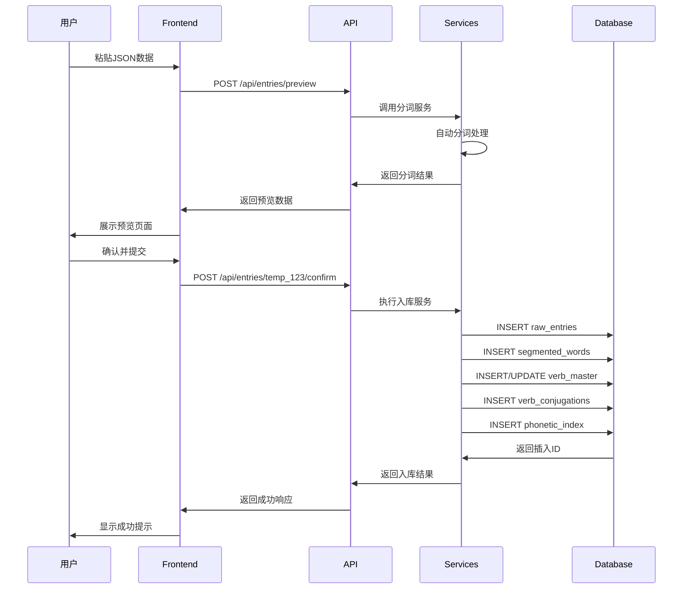
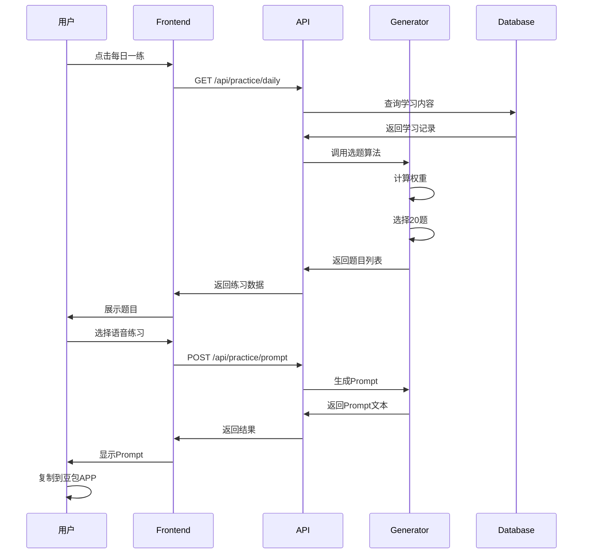

# 04-API接口设计

> 言葉AI (Kotoba AI) RESTful API接口规范

---

## 4.1 接口设计原则

### 4.1.1 RESTful规范

```mermaid
flowchart TB
    subgraph HTTP方法
        G[GET] --> R[读取资源]
        P[POST] --> C[创建资源]
        U[PUT/PATCH] --> U2[更新资源]
        D[DELETE] --> D2[删除资源]
    end
    
    subgraph URL设计
        A[/api/entries] --> B[资源复数形式]
        B --> C[名词而非动词]
        C --> D[层级关系清晰]
    end
```

### 4.1.2 响应格式

```json
{
  "success": true,
  "data": {},
  "message": "操作成功",
  "timestamp": "2026-02-11T15:30:00Z"
}
```

错误响应：
```json
{
  "success": false,
  "error": {
    "code": "VALIDATION_ERROR",
    "message": "输入数据验证失败",
    "details": ["original_jp字段不能为空"]
  },
  "timestamp": "2026-02-11T15:30:00Z"
}
```

---

## 4.2 API接口列表

### 4.2.1 录入相关接口

#### 1. 创建原始录入（预览模式）

```http
POST /api/entries/preview
Content-Type: application/json
```

**请求参数**：
```json
{
  "content_type": "sentence",
  "original_jp": "私は学生です",
  "hiragana": "わたしはがくせいです",
  "romaji": "watashi wa gakusei desu",
  "chinese_meaning": "我是学生",
  "source": "duolingo_20260211_001.png",
  "tags": {
    "grammar_points": ["は主题助词"],
    "difficulty": 1
  }
}
```

**响应**：
```json
{
  "success": true,
  "data": {
    "preview_id": "temp_123456",
    "original_data": { /* 原始数据 */ },
    "segmented_words": [
      {
        "word_jp": "私",
        "hiragana": "わたし",
        "word_type": "pronoun",
        "position": 1,
        "grammar_info": {"meaning": "我"}
      },
      {
        "word_jp": "は",
        "hiragana": "は",
        "word_type": "particle",
        "position": 2,
        "grammar_info": {"meaning": "主题助词"}
      },
      {
        "word_jp": "学生",
        "hiragana": "がくせい",
        "word_type": "noun",
        "position": 3,
        "grammar_info": {"meaning": "学生"}
      },
      {
        "word_jp": "です",
        "hiragana": "です",
        "word_type": "aux_verb",
        "position": 4,
        "grammar_info": {"meaning": "是"}
      }
    ],
    "verbs_detected": [],
    "phonetic_index": ["わ", "た", "し", "は", "が", "く", "せ", "い", "で", "す"]
  },
  "message": "预览生成成功，请确认后提交"
}
```

**说明**：此接口仅生成分词预览，**不写入数据库**。

---

#### 2. 确认并入库

```http
POST /api/entries/:preview_id/confirm
Content-Type: application/json
```

**请求参数**：
```json
{
  "modifications": {
    "segmented_words": [
      {
        "position": 1,
        "word_type": "pronoun",
        "verb_id": null
      }
    ]
  }
}
```

**响应**：
```json
{
  "success": true,
  "data": {
    "entry_id": 1,
    "segmented_count": 4,
    "verbs_added": 0,
    "phonetic_indexed": 10
  },
  "message": "数据入库成功"
}
```

**说明**：确认后真正写入所有相关表。

---

#### 3. 获取录入列表

```http
GET /api/entries?page=1&limit=20&content_type=sentence&order_by=created_at&order=desc
```

**查询参数**：
- `page`: 页码（默认1）
- `limit`: 每页数量（默认20）
- `content_type`: 筛选类型（sentence/word/phrase）
- `order_by`: 排序字段
- `order`: 排序方向（asc/desc）

**响应**：
```json
{
  "success": true,
  "data": {
    "items": [
      {
        "id": 1,
        "content_type": "sentence",
        "original_jp": "私は学生です",
        "hiragana": "わたしはがくせいです",
        "chinese_meaning": "我是学生",
        "created_at": "2026-02-11T14:30:00Z",
        "word_count": 4
      }
    ],
    "pagination": {
      "page": 1,
      "limit": 20,
      "total": 156,
      "total_pages": 8
    }
  }
}
```

---

#### 4. 获取录入详情

```http
GET /api/entries/:id
```

**响应**：
```json
{
  "success": true,
  "data": {
    "id": 1,
    "content_type": "sentence",
    "original_jp": "私は学生です",
    "hiragana": "わたしはがくせいです",
    "romaji": "watashi wa gakusei desu",
    "chinese_meaning": "我是学生",
    "source": "duolingo_20260211_001.png",
    "created_at": "2026-02-11T14:30:00Z",
    "tags": {
      "grammar_points": ["は主题助词"],
      "difficulty": 1
    },
    "segmented_words": [
      {
        "id": 1,
        "word_jp": "私",
        "hiragana": "わたし",
        "word_type": "pronoun",
        "position": 1,
        "grammar_info": {"meaning": "我"}
      }
      // ... 其他分词
    ]
  }
}
```

---

#### 5. 更新录入

```http
PUT /api/entries/:id
Content-Type: application/json
```

**请求参数**：
```json
{
  "chinese_meaning": "我是大学生",
  "tags": {
    "difficulty": 2
  }
}
```

---

#### 6. 删除录入

```http
DELETE /api/entries/:id
```

**响应**：
```json
{
  "success": true,
  "message": "删除成功"
}
```

---

### 4.2.2 50音检索接口

#### 7. 获取50音图表

```http
GET /api/phonetics
```

**响应**：
```json
{
  "success": true,
  "data": {
    "gojyuon": {
      "あ段": ["あ", "い", "う", "え", "お"],
      "か段": ["か", "き", "く", "け", "こ"],
      // ... 其他行
    },
    "dakuon": {
      "が段": ["が", "ぎ", "ぐ", "げ", "ご"],
      // ... 浊音
    },
    "handakuon": {
      "ぱ段": ["ぱ", "ぴ", "ぷ", "ぺ", "ぽ"]
    }
  }
}
```

---

#### 8. 按50音检索

```http
GET /api/phonetics/:character/entries?type=all&page=1&limit=20
```

**路径参数**：
- `:character`: 50音字符（如「か」）

**查询参数**：
- `type`: 检索类型（all/raw/segmented，默认all）
- `match_type`: 匹配类型（exact/fuzzy，默认exact）

**响应**：
```json
{
  "success": true,
  "data": {
    "phonetic": "か",
    "total_count": 45,
    "raw_entries": [
      {
        "id": 1,
        "original_jp": "私は学生です",
        "matched_word": "学生",
        "context": "...がくせい..."
      }
    ],
    "segmented_words": [
      {
        "id": 3,
        "word_jp": "学生",
        "hiragana": "がくせい",
        "word_type": "noun"
      }
    ]
  }
}
```

---

### 4.2.3 分类表接口

#### 9. 获取分类统计

```http
GET /api/categories/stats
```

**响应**：
```json
{
  "success": true,
  "data": {
    "nouns": 68,
    "verbs": 42,
    "adjectives": 23,
    "particles": 15,
    "others": 8
  }
}
```

---

#### 10. 获取分类详情

```http
GET /api/categories/:type?page=1&limit=50&sort_by=created_at
```

**路径参数**：
- `:type`: 分类类型（nouns/verbs/adjectives/particles/all）

**响应**（以verbs为例）：
```json
{
  "success": true,
  "data": {
    "type": "verbs",
    "count": 42,
    "items": [
      {
        "id": 6,
        "word_jp": "遊ぶ",
        "hiragana": "あそぶ",
        "prototype": "遊ぶ",
        "meaning": "玩耍",
        "verb_class": "一类动词",
        "from_sentence": "ちびまる子ちゃんと一緒におもちゃで遊ぶ",
        "created_at": "2026-02-11T15:20:00Z"
      }
    ],
    "pagination": {
      "page": 1,
      "limit": 50,
      "total": 42,
      "total_pages": 1
    }
  }
}
```

---

### 4.2.4 动词接口

#### 11. 获取动词详情（含活用）

```http
GET /api/verbs/:id
```

**响应**：
```json
{
  "success": true,
  "data": {
    "id": 1,
    "prototype": "遊ぶ",
    "reading": "あそぶ",
    "meaning": "玩耍、游玩",
    "verb_class": "一类动词",
    "verb_group": "godan",
    "stem": "遊び",
    "example_count": 5,
    "conjugations": [
      {
        "form_type": "dictionary",
        "form_name": "辞書形",
        "form_value": "遊ぶ",
        "reading": "あそぶ",
        "example": "公園で遊ぶ"
      },
      {
        "form_type": "masu",
        "form_name": "ます形",
        "form_value": "遊びます",
        "reading": "あそびます",
        "example": "友達と遊びます"
      }
      // ... 其他10种活用
    ]
  }
}
```

---

#### 12. 搜索动词

```http
GET /api/verbs/search?q=遊&verb_class=一类动词
```

---

### 4.2.5 每日一练接口

#### 13. 生成每日一练

```http
GET /api/practice/daily?count=20
```

**查询参数**：
- `count`: 题目数量（默认20）

**响应**：
```json
{
  "success": true,
  "data": {
    "date": "2026-02-11",
    "total_questions": 20,
    "questions": [
      {
        "id": 1,
        "type": "translation_jp_to_cn",
        "question": "私は学生です",
        "options": ["我是学生", "你是学生", "他是学生"],
        "correct_answer": "我是学生",
        "source_entry_id": 1,
        "is_new": true,
        "days_since_created": 0
      },
      {
        "id": 2,
        "type": "translation_cn_to_jp",
        "question": "和樱桃小丸子一起玩玩具",
        "hint": "ちびまる子ちゃんと...",
        "correct_answer": "ちびまる子ちゃんと一緒におもちゃで遊ぶ",
        "source_entry_id": 2,
        "is_new": false,
        "days_since_created": 3
      },
      {
        "id": 3,
        "type": "verb_conjugation",
        "question": "遊ぶ的て形是？",
        "options": ["遊びて", "遊んで", "遊びって"],
        "correct_answer": "遊んで",
        "verb_id": 1,
        "is_new": false,
        "days_since_created": 5
      }
    ],
    "stats": {
      "new_content": 8,
      "recent_review": 6,
      "old_review": 4,
      "random": 2
    }
  }
}
```

---

#### 14. 生成豆包Prompt

```http
POST /api/practice/prompt
Content-Type: application/json
```

**请求参数**：
```json
{
  "questions": [1, 2, 3, 4, 5],  // 题目ID列表
  "style": "gentle",  // gentle/strict（温柔/严格模式）
  "include_hints": true
}
```

**响应**：
```json
{
  "success": true,
  "data": {
    "prompt": "【日语每日一练 - 2026年2月11日】\n\n我是你的日语学生，请按以下顺序考我20道题。\n\n每道题：\n1. 用中文或日语说出题目\n2. 等我回答（语音）\n3. 温柔地纠正我的发音和语法错误\n4. 给出正确答案\n5. 简单讲解相关语法点\n\n题目列表：\n\n第1题：请翻译「私は学生です」\n提示：这是一句自我介绍\n\n第2题：「和樱桃小丸子一起玩玩具」用日语怎么说？\n提示：ちびまる子ちゃんと...\n\n...（共20题）\n\n请一题一题来，不要一次性说完。准备好后请说「我们开始吧」。",
    "question_count": 20,
    "estimated_time": "15-20分钟"
  }
}
```

---

#### 15. 提交练习结果

```http
POST /api/practice/submit
Content-Type: application/json
```

**请求参数**：
```json
{
  "date": "2026-02-11",
  "answers": [
    {
      "question_id": 1,
      "is_correct": true,
      "user_answer": "我是学生"
    },
    {
      "question_id": 2,
      "is_correct": false,
      "user_answer": "ちびまるこちゃんとおもちゃであそぶ"
    }
  ],
  "completed": true
}
```

**响应**：
```json
{
  "success": true,
  "data": {
    "score": 18,
    "total": 20,
    "accuracy": 0.9,
    "wrong_questions": [2, 15],
    "review_recommendations": ["动词て形", "助词と的用法"]
  }
}
```

---

### 4.2.6 统计接口

#### 16. 学习统计

```http
GET /api/stats/overview
```

**响应**：
```json
{
  "success": true,
  "data": {
    "total_entries": 156,
    "total_words": 342,
    "total_verbs": 42,
    "today_new": 5,
    "streak_days": 12,
    "last_practice": "2026-02-10",
    "practice_count": 23,
    "average_score": 0.85
  }
}
```

---

## 4.3 错误码设计

### 4.3.1 错误码列表

| 错误码 | HTTP状态码 | 说明 |
|--------|-----------|------|
| `SUCCESS` | 200 | 操作成功 |
| `VALIDATION_ERROR` | 400 | 输入数据验证失败 |
| `NOT_FOUND` | 404 | 资源不存在 |
| `ALREADY_EXISTS` | 409 | 资源已存在 |
| `INTERNAL_ERROR` | 500 | 服务器内部错误 |

### 4.3.2 错误响应示例

```json
{
  "success": false,
  "error": {
    "code": "VALIDATION_ERROR",
    "message": "输入数据验证失败",
    "field_errors": {
      "original_jp": ["不能为空"],
      "hiragana": ["格式不正确"]
    }
  },
  "timestamp": "2026-02-11T15:30:00Z"
}
```

---

## 4.4 接口调用流程图

### 4.4.1 完整录入流程



### 4.4.2 每日一练流程



---

**文档版本**: v1.0  
**创建日期**: 2026-02-11
