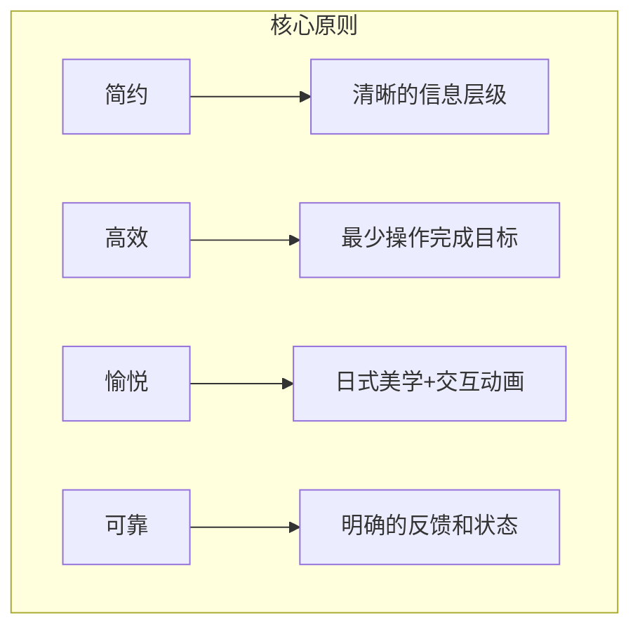
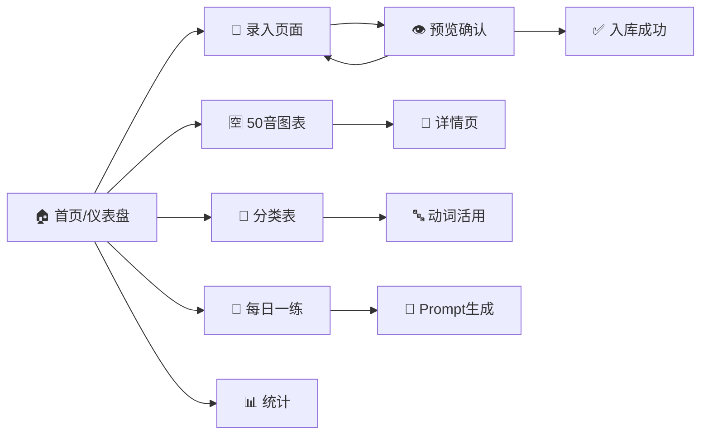
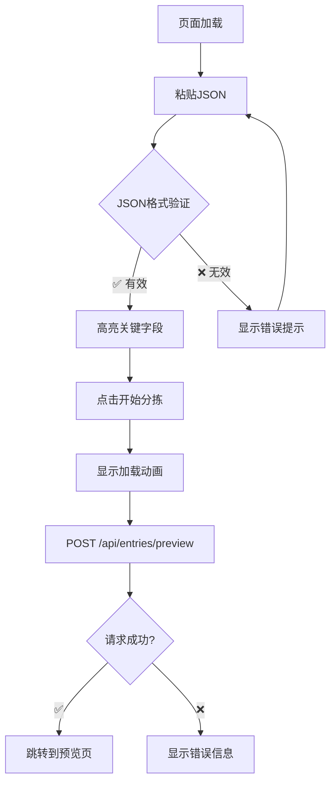
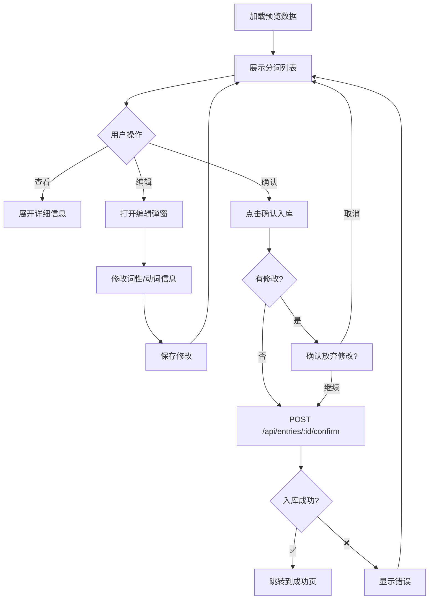
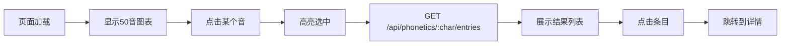
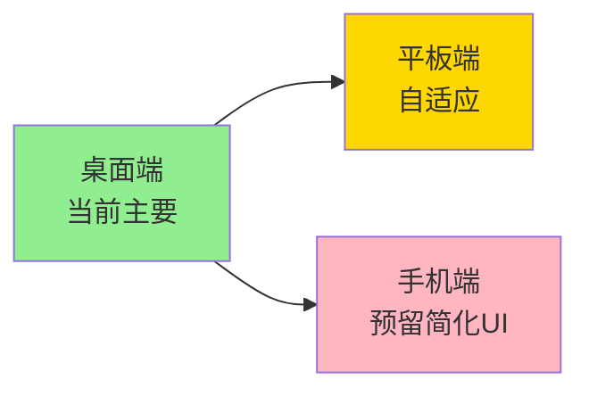

# 05-前端设计

> 言葉AI (Kotoba AI) UI/UX设计与页面流程

---

## 5.1 设计原则

### 5.1.1 设计理念



### 5.1.2 视觉风格

- **主色调**：樱花粉（#FFB7C5）+ 靛蓝（#4A5568）
- **辅助色**：淡金（#F6E05E）+ 薄荷绿（#9AE6B4）
- **字体**：Noto Sans JP（日语支持）+ system-ui
- **圆角**：16px（卡片）/ 8px（按钮）
- **阴影**：柔和阴影（0 4px 6px rgba(0,0,0,0.1)）

---

## 5.2 页面结构

### 5.2.1 页面导航图



### 5.2.2 页面清单

| 页面 | 路径 | 功能描述 | 优先级 |
|------|------|----------|--------|
| 首页 | `/` | 仪表盘、快捷入口、统计概览 | 高 |
| 录入页 | `/input` | 粘贴JSON、开始分拣 | 高 |
| 预览确认 | `/preview/:id` | 查看分词、修改、确认入库 | 高 |
| 50音图表 | `/gojyuon` | 交互式50音表、检索 | 高 |
| 分类表 | `/categories` | 名/动/形/助词分类浏览 | 高 |
| 动词详情 | `/verbs/:id` | 动词完整活用展示 | 高 |
| 每日一练 | `/practice` | 生成题目、答题、Prompt | 高 |
| 统计页 | `/stats` | 学习数据统计 | 中 |

---

## 5.3 页面详细设计

### 5.3.1 首页/仪表盘

#### 布局结构

```
┌─────────────────────────────────────────────────────────────┐
│  🌸 言葉AI                    [录入] [练习] [图表]          │
├─────────────────────────────────────────────────────────────┤
│                                                             │
│  ┌──────────────┐  ┌────────────────────────────────────┐  │
│  │  学习进度     │  │  📈 学习统计                        │  │
│  │              │  │                                    │  │
│  │  ████████░░  │  │  总词数: 342    动词: 42           │  │
│  │  80% 完成    │  │  形容词: 23     助词: 15           │  │
│  │              │  │  连续学习: 12天                    │  │
│  │  [今日目标]   │  │  今日新学: 5个                     │  │
│  └──────────────┘  └────────────────────────────────────┘  │
│                                                             │
│  ┌────────────┬────────────┬────────────┬────────────┐    │
│  │ 🈳 50音图  │ 📑 分类表  │ 📚 词库   │ 📊 统计    │    │
│  └────────────┴────────────┴────────────┴────────────┘    │
│                                                             │
│  ┌─────────────────────────────────────────────────────┐   │
│  │  🎯 今日练习                                         │   │
│  │  20题待完成 | 预计15分钟 | [开始练习]               │   │
│  └─────────────────────────────────────────────────────┘   │
│                                                             │
└─────────────────────────────────────────────────────────────┘
```

#### 关键组件

- **导航栏**：Logo + 快捷操作按钮
- **学习进度卡片**：圆形进度条 + 今日目标
- **统计面板**：数字卡片网格
- **功能入口**：4个主要功能的快捷入口
- **练习卡片**：今日练习状态和行动按钮

---

### 5.3.2 录入页面

#### 布局结构

```
┌─────────────────────────────────────────────────────────────┐
│  🌸 言葉AI                                    [返回首页]    │
├─────────────────────────────────────────────────────────────┤
│                                                             │
│  ┌─────────────────────────────────────────────────────┐   │
│  │  步骤1: 粘贴AI识别结果                                │   │
│  │                                                      │   │
│  │  ┌───────────────────────────────────────────────┐  │   │
│  │  │                                                 │  │   │
│  │  │  在此粘贴JSON...                                │  │   │
│  │  │                                                 │  │   │
│  │  │  {                                              │  │   │
│  │  │    "original_jp": "私は学生です",               │  │   │
│  │  │    "hiragana": "わたしはがくせいです",          │  │   │
│  │  │    ...                                          │  │   │
│  │  │  }                                              │  │   │
│  │  │                                                 │  │   │
│  │  └───────────────────────────────────────────────┘  │   │
│  │                                                      │   │
│  │  [📋 粘贴示例]  [🗑️ 清空]                           │   │
│  │                                                      │   │
│  │  [开始分拣 ▶️]                                       │   │
│  └─────────────────────────────────────────────────────┘   │
│                                                             │
│  ┌─────────────────────────────────────────────────────┐   │
│  │  💡 提示                                             │   │
│  │  1. 在多邻国学习后截图                               │   │
│  │  2. 发送给AI助手识别                                 │   │
│  │  3. 复制返回的JSON粘贴到这里                         │   │
│  └─────────────────────────────────────────────────────┘   │
│                                                             │
└─────────────────────────────────────────────────────────────┘
```

#### 交互流程



---

### 5.3.3 预览确认页面 ⭐关键页面

#### 布局结构

```
┌─────────────────────────────────────────────────────────────┐
│  🌸 言葉AI              [上一步] [确认入库 ✅]              │
├─────────────────────────────────────────────────────────────┤
│                                                             │
│  ┌─────────────────────────────────────────────────────┐   │
│  │  📄 原文                                             │   │
│  │  私は学生です                                        │   │
│  │  わたしはがくせいです                                │   │
│  │  watashi wa gakusei desu                            │   │
│  └─────────────────────────────────────────────────────┘   │
│                                                             │
│  🔍 自动分词结果 (4个词语):                                 │
│                                                             │
│  ┌─────────┬──────────┬─────────┬────────────────────────┐ │
│  │ 位置    │ 词语      │ 词性    │ 操作                   │ │
│  ├─────────┼──────────┼─────────┼────────────────────────┤ │
│  │ 1       │ 私       │ 代词    │ [✏️]                   │ │
│  │ 2       │ は       │ 助词    │ [✏️]                   │ │
│  │ 3       │ 学生     │ 名词    │ [✏️]                   │ │
│  │ 4       │ です     │ 助动词  │ [✏️]                   │ │
│  └─────────┴──────────┴─────────┴────────────────────────┘ │
│                                                             │
│  🔤 动词识别:                                               │
│  ┌─────────────────────────────────────────────────────┐   │
│  │  ⚠️ 未检测到动词，或动词已存在于数据库               │   │
│  │                                                      │   │
│  │  [+ 手动添加动词]                                    │   │
│  └─────────────────────────────────────────────────────┘   │
│                                                             │
│  🈳 50音索引:                                               │
│  わ、た、し、は、が、く、せ、い、で、す                     │
│                                                             │
│  ┌─────────────────────────────────────────────────────┐   │
│  │  ⚠️ 请在确认前检查分词是否正确                       │   │
│  │  确认后将写入数据库，不可撤销                        │   │
│  └─────────────────────────────────────────────────────┘   │
│                                                             │
└─────────────────────────────────────────────────────────────┘
```

#### 编辑词性弹窗

```
┌─────────────────────────────────────────┐
│  ✏️ 编辑词语                            │
├─────────────────────────────────────────┤
│                                         │
│  词语: 遊びます                         │
│  读音: あそびます                       │
│                                         │
│  词性: [动词 ▼]                         │
│                                         │
│  如果是动词:                            │
│  原型: [遊ぶ        ] 🔍搜索            │
│  当前变形: [ます形 ▼]                   │
│                                         │
│  语法信息:                              │
│  ┌─────────────────────────────────┐   │
│  │ 意思: 玩耍                       │   │
│  │ 类别: 一类动词                   │   │
│  └─────────────────────────────────┘   │
│                                         │
│           [取消]  [保存]                │
│                                         │
└─────────────────────────────────────────┘
```

#### 交互流程



---

### 5.3.4 50音图表页

#### 布局结构

```
┌─────────────────────────────────────────────────────────────┐
│  🌸 言葉AI                                    [🔍 搜索]     │
├─────────────────────────────────────────────────────────────┤
│                                                             │
│  [平假名] [片假名]                                          │
│                                                             │
│  あ行    [あ] [い] [う] [え] [お]                          │
│  か行    [か] [き] [く] [け] [こ]                          │
│  さ行    [さ] [し] [す] [せ] [そ]                          │
│  た行    [た] [ち] [つ] [て] [と]                          │
│  ...                                                       │
│                                                             │
│  浊音・半浊音                                               │
│  が行    [が] [ぎ] [ぐ] [げ] [ご]                          │
│  ...                                                       │
│                                                             │
├─────────────────────────────────────────────────────────────┤
│  点击「か」的检索结果 (23条):                               │
│                                                             │
│  ┌─────────────────────────────────────────────────────┐   │
│  │  📄 私は学生です                                      │   │
│  │     包含: 学生(がくせい)                              │   │
│  │     录入: 2026-02-11                                 │   │
│  └─────────────────────────────────────────────────────┘   │
│  ┌─────────────────────────────────────────────────────┐   │
│  │  📄 かばんを買いました                                │   │
│  │     包含: かばん                                      │   │
│  │     录入: 2026-02-10                                 │   │
│  └─────────────────────────────────────────────────────┘   │
│                                                             │
└─────────────────────────────────────────────────────────────┘
```

#### 交互流程



---

### 5.3.5 分类表页

#### 布局结构

```
┌─────────────────────────────────────────────────────────────┐
│  🌸 言葉AI                                                │
├─────────────────────────────────────────────────────────────┤
│                                                             │
│  [名词 68] [动词 42] [形容词 23] [助词 15] [全部]           │
│                                                             │
│  🔤 动词列表 (42个):                                        │
│                                                             │
│  ┌──────────┬──────────┬──────────┬──────────┬──────────┐  │
│  │ 遊ぶ     │ 食べる   │ 行く     │ 来る     │ 見る     │  │
│  │ 玩耍     │ 吃       │ 去       │ 来       │ 看       │  │
│  │ [12活用] │ [12活用] │ [12活用] │ [12活用] │ [12活用] │  │
│  └──────────┴──────────┴──────────┴──────────┴──────────┘  │
│                                                             │
│  分页: [1] [2] [3] ... [9]                                  │
│                                                             │
│  ┌─────────────────────────────────────────────────────┐   │
│  │  💡 点击动词查看完整的12种活用形式                    │   │
│  └─────────────────────────────────────────────────────┘   │
│                                                             │
└─────────────────────────────────────────────────────────────┘
```

---

### 5.3.6 动词活用详情页

#### 布局结构

```
┌─────────────────────────────────────────────────────────────┐
│  🌸 言葉AI                  [← 返回动词列表]                │
├─────────────────────────────────────────────────────────────┤
│                                                             │
│  ┌─────────────────────────────────────────────────────┐   │
│  │                                                     │   │
│  │           遊ぶ (あそぶ)                              │   │
│  │           玩耍 / to play                             │   │
│  │                                                     │   │
│  │           一类动词 | 五段活用                        │   │
│  │                                                     │   │
│  └─────────────────────────────────────────────────────┘   │
│                                                             │
│  📚 12种活用形式:                                           │
│                                                             │
│  ┌───────────┬───────────┬───────────┬──────────────┐      │
│  │ 辞書形    │ ます形    │ て形      │ た形         │      │
│  │ 遊ぶ      │ 遊びます  │ 遊んで    │ 遊んだ       │      │
│  │ あそぶ    │ あそびます│ あそんで  │ あそんだ     │      │
│  └───────────┴───────────┴───────────┴──────────────┘      │
│  ┌───────────┬───────────┬───────────┬──────────────┐      │
│  │ ない形    │ 可能形    │ 受身形    │ 使役形       │      │
│  │ 遊ばない  │ 遊べる    │ 遊ばれる  │ 遊ばせる     │      │
│  └───────────┴───────────┴───────────┴──────────────┘      │
│  ┌───────────┬───────────┬───────────┬──────────────┐      │
│  │ 使役受身  │ 意志形    │ 命令形    │ 条件形       │      │
│  │ 遊ばせ... │ 遊ぼう    │ 遊べ      │ 遊べば       │      │
│  └───────────┴───────────┴───────────┴──────────────┘      │
│                                                             │
│  📖 例句:                                                   │
│  • 公園で遊ぶ (在公园玩耍)                                  │
│  • 友達と遊びます (和朋友一起玩)                            │
│                                                             │
│  📊 出现次数: 5次 | 首次学习: 2026-02-11                    │
│                                                             │
└─────────────────────────────────────────────────────────────┘
```

---

### 5.3.7 每日一练页

#### 布局结构

```
┌─────────────────────────────────────────────────────────────┐
│  🌸 言葉AI                  [← 返回首页]                    │
├─────────────────────────────────────────────────────────────┤
│                                                             │
│  ┌─────────────────────────────────────────────────────┐   │
│  │  🎯 每日一练 - 2026年2月11日                        │   │
│  │                                                     │   │
│  │  进度: 第 1/20 题    已答对: 0    正确率: --        │   │
│  └─────────────────────────────────────────────────────┘   │
│                                                             │
│  ┌─────────────────────────────────────────────────────┐   │
│  │                                                     │   │
│  │  📌 第1题                                          │   │
│  │                                                     │   │
│  │  请翻译以下句子:                                    │   │
│  │                                                     │   │
│  │  「私は学生です」                                   │   │
│  │                                                     │   │
│  │  [我是学生]                                        │   │
│  │  [你是学生]                                        │   │
│  │  [他是学生]                                        │   │
│  │                                                     │   │
│  │              [下一题 →]                            │   │
│  │                                                     │   │
│  └─────────────────────────────────────────────────────┘   │
│                                                             │
│  ┌─────────────────────────────────────────────────────┐   │
│  │  🎤 或者，使用语音练习:                              │   │
│  │                                                     │   │
│  │  [生成豆包Prompt]                                   │   │
│  │                                                     │   │
│  └─────────────────────────────────────────────────────┘   │
│                                                             │
└─────────────────────────────────────────────────────────────┘
```

#### 答题结果反馈

```
┌─────────────────────────────────────────────────────────────┐
│  ✅ 回答正确!                                               │
├─────────────────────────────────────────────────────────────┤
│                                                             │
│  私は学生です = 我是学生                                    │
│                                                             │
│  📚 语法点:                                                │
│  • は: 主题助词，标记句子主题                               │
│  • です: 判断助动词，礼貌体                                 │
│                                                             │
│              [下一题 →]  [查看详情]                        │
│                                                             │
└─────────────────────────────────────────────────────────────┘
```

---

### 5.3.8 Prompt生成弹窗

```
┌─────────────────────────────────────────────────────────────┐
│  💬 豆包语音练习Prompt                                       │
├─────────────────────────────────────────────────────────────┤
│                                                             │
│  ┌─────────────────────────────────────────────────────┐   │
│  │ 【日语每日一练 - 2026年2月11日】                     │   │
│  │                                                      │   │
│  │ 我是你的日语学生，请按以下顺序考我20道题。           │   │
│  │                                                      │   │
│  │ 每道题：                                             │   │
│  │ 1. 用中文或日语说出题目                               │   │
│  │ 2. 等我回答（语音）                                   │   │
│  │ 3. 温柔地纠正我的发音和语法错误                       │   │
│  │ 4. 给出正确答案                                      │   │
│  │                                                      │   │
│  │ 题目列表：                                           │   │
│  │ 第1题：请翻译「私は学生です」                         │   │
│  │ ...                                                  │   │
│  │                                                      │   │
│  │ 请一题一题来，不要一次性说完。                       │   │
│  └─────────────────────────────────────────────────────┘   │
│                                                             │
│  [📋 复制到剪贴板]  [📱 打开豆包APP]                       │
│                                                             │
│  💡 提示: 复制Prompt后，打开豆包APP的语音对话功能粘贴即可  │
│                                                             │
└─────────────────────────────────────────────────────────────┘
```

---

## 5.4 响应式设计策略

### 5.4.1 断点设计

```css
/* 桌面优先 */
@media (max-width: 1024px) { /* 平板 */
  .grid-4 { grid-template-columns: repeat(2, 1fr); }
}

@media (max-width: 640px) { /* 手机 */
  .grid-4 { grid-template-columns: 1fr; }
  .sidebar { display: none; }
  .bottom-nav { display: flex; }
}
```

### 5.4.2 移动端预留



---

## 5.5 交互动画设计

### 5.5.1 动画规范

| 动画 | 时长 | 缓动函数 | 用途 |
|------|------|----------|------|
| 页面切换 | 300ms | ease-in-out | 路由切换 |
| 卡片悬停 | 200ms | ease-out | hover效果 |
| 模态框 | 250ms | cubic-bezier(0.4, 0, 0.2, 1) | 弹窗 |
| 加载动画 | 800ms | linear | 无限循环 |
| 数字变化 | 500ms | ease-out | 统计数字 |

### 5.5.2 微交互示例

```css
/* 按钮悬停 */
.btn-primary {
  transition: all 0.2s ease-out;
}
.btn-primary:hover {
  transform: translateY(-2px);
  box-shadow: 0 4px 12px rgba(255, 183, 197, 0.4);
}

/* 卡片悬停 */
.card {
  transition: transform 0.2s, box-shadow 0.2s;
}
.card:hover {
  transform: translateY(-4px);
  box-shadow: 0 8px 24px rgba(0,0,0,0.12);
}

/* 加载动画 */
.loading {
  animation: pulse 0.8s ease-in-out infinite;
}
```

---

**文档版本**: v1.0  
**创建日期**: 2026-02-11
