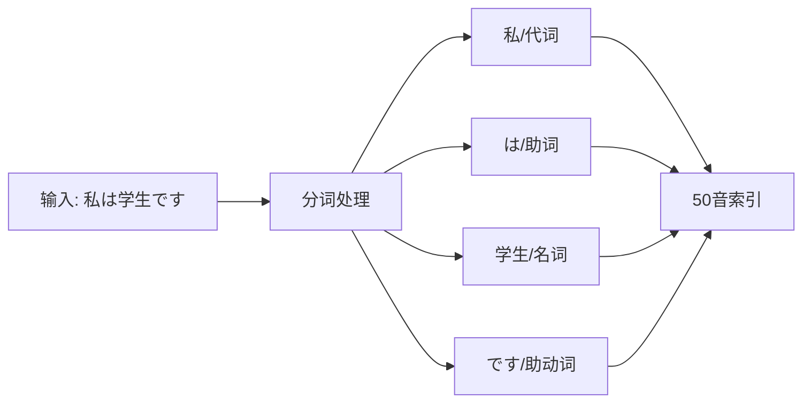
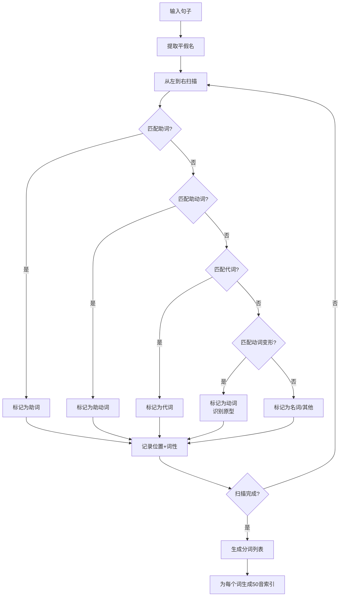
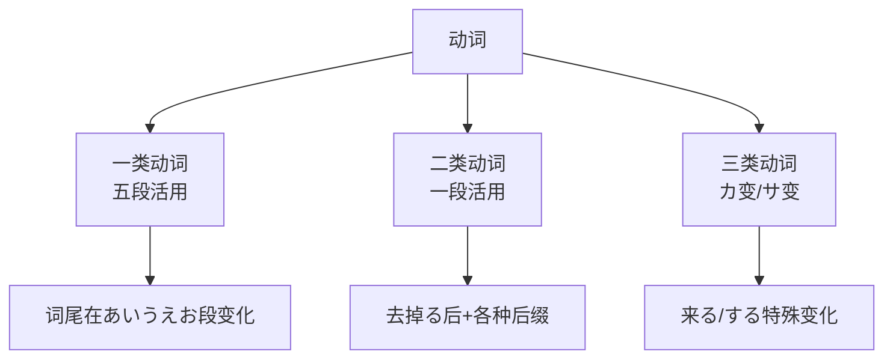
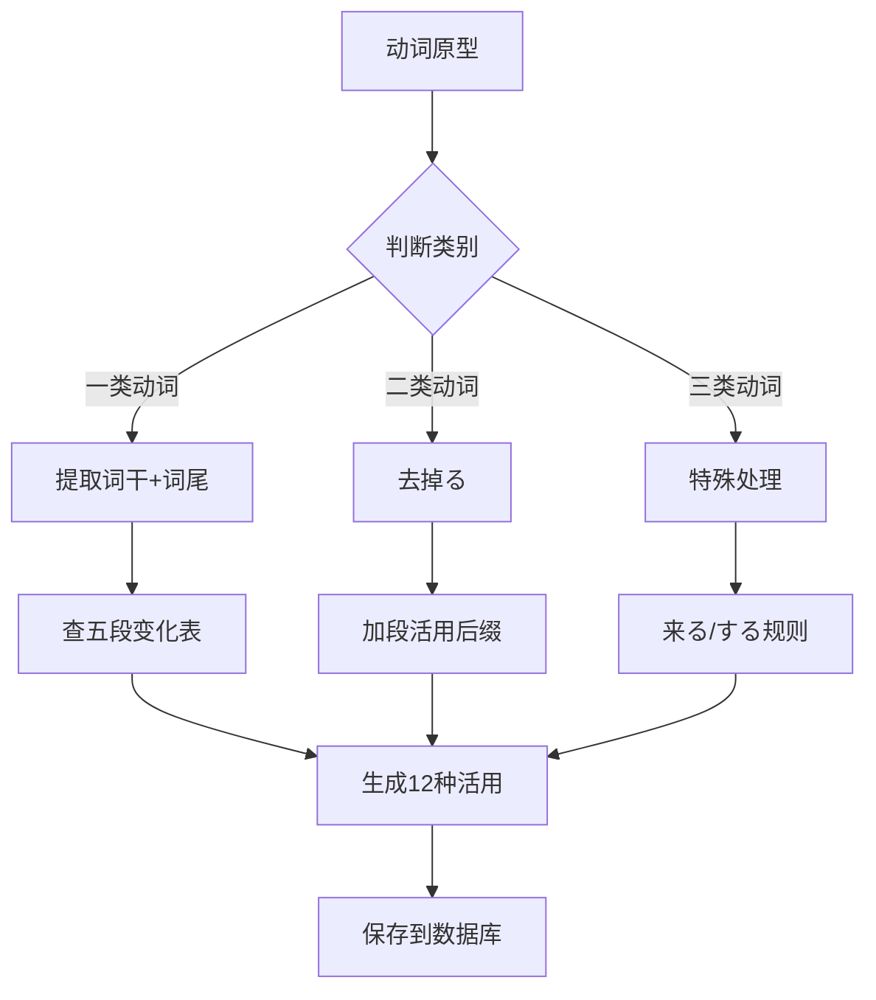
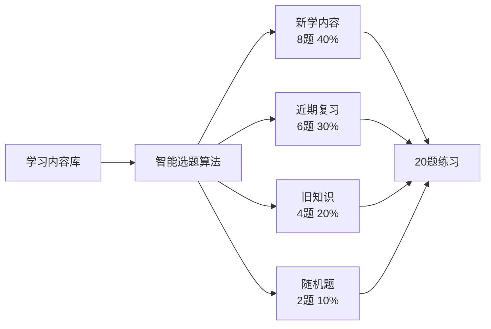

# 06-核心算法设计

> 言葉AI (Kotoba AI) 核心算法设计文档

---

## 6.1 自动分词算法

### 6.1.1 算法目标

将日文句子自动分词，识别每个词的词性，并与50音建立索引。



### 6.1.2 分词策略

由于日语没有空格，我们采用**规则+词典**的混合策略：

```python
class JapaneseSegmenter:
    """日文分词器"""
    
    def __init__(self):
        # 常用助词列表
        self.particles = ['は', 'が', 'を', 'に', 'で', 'へ', 'と', 'から', 'まで', 
                         'より', 'も', 'や', 'か', 'ね', 'よ', 'わ']
        
        # 常见助动词
        self.aux_verbs = ['です', 'ます', 'たい', 'たがる', 'らしい', 'そうだ', 
                         'ようだ', 'だ', 'である']
        
        # 常用代词
        self.pronouns = ['私', 'わたし', '僕', 'ぼく', '俺', 'おれ', 
                        'あなた', '君', 'きみ', '彼', 'かれ', '彼女', 'かのじょ']
    
    def segment(self, text: str, hiragana: str) -> List[SegmentedWord]:
        """
        分词主函数
        
        Args:
            text: 原文
            hiragana: 平假名注音
            
        Returns:
            分词结果列表
        """
        words = []
        position = 0
        
        # 策略1: 识别助词（通常1-2字符）
        # 策略2: 识别助动词（通常2-4字符）
        # 策略3: 识别代词
        # 策略4: 识别动词（通过变形特征）
        # 策略5: 剩余部分按词长分割
        
        return words
```

### 6.1.3 分词流程



### 6.1.4 动词识别规则

```python
def detect_verb(word: str, hiragana: str) -> Optional[VerbInfo]:
    """
    识别动词及其原型
    
    规则：
    1. 以「ます」结尾 → 原型是「る」→ 二类动词
    2. 以「ました」结尾 → 过去形「ます」→ 原型二类
    3. 以「ません」结尾 → 否定「ます」→ 原型二类
    4. 以「て/で」结尾 → て形 → 需要分析词尾
    5. 以「た/だ」结尾 → た形 → 需要分析词尾
    6. 以「ない」结尾 → ない形 → 需要分析
    """
    
    # 示例识别
    if word.endswith('ます'):
        # 食べます → 食べる
        stem = word[:-2]  # 食べ
        return VerbInfo(
            prototype=f"{stem}る",
            form='masu',
            verb_class='二类动词'
        )
    
    elif word.endswith('ました'):
        stem = word[:-3]
        return VerbInfo(
            prototype=f"{stem}る",
            form='mashita',
            verb_class='二类动词'
        )
    
    # 更多规则...
    
    return None
```

### 6.1.5 50音索引生成

```python
def generate_phonetic_index(hiragana: str) -> List[str]:
    """
    从平假名提取50音索引
    
    Args:
        hiragana: 平假名字符串
        
    Returns:
        去重后的50音字符列表
    """
    # 50音字符集
    gojyuon = set('あいうえおかきくけこさしすせそたちつてとなにぬねの'
                  'はひふへほまみむめもやゆよらりるれろわをん'
                  'がぎぐげござじずぜぞだぢづでどばびぶべぼ'
                  'ぱぴぷぺぽ')
    
    # 提取并去重
    phonetics = []
    seen = set()
    
    for char in hiragana:
        if char in gojyuon and char not in seen:
            phonetics.append(char)
            seen.add(char)
    
    return phonetics
```

---

## 6.2 动词活用生成算法

### 6.2.1 动词分类和活用规则



### 6.2.2 活用生成器

```python
class VerbConjugator:
    """动词活用生成器"""
    
    # 一类动词（五段）词尾变化表
    GODAN_CONJUGATIONS = {
        'う': {
            'dictionary': 'う',
            'masu': 'います',
            'te': 'って',
            'ta': 'った',
            'nai': 'わない',
            'potential': 'える',
            'passive': 'われる',
            'causative': 'わせる',
            'causative_passive': 'わせられる',
            'volitional': 'おう',
            'imperative': 'え',
            'conditional': 'えば'
        },
        'く': {
            'dictionary': 'く',
            'masu': 'きます',
            'te': 'いて',  # 音便
            'ta': 'いた',
            'nai': 'かない',
            'potential': 'ける',
            'passive': 'かれる',
            'causative': 'かせる',
            'causative_passive': 'かせられる',
            'volitional': 'こう',
            'imperative': 'け',
            'conditional': 'けば'
        },
        'ぐ': {
            'dictionary': 'ぐ',
            'masu': 'ぎます',
            'te': 'いで',  # 音便
            'ta': 'いだ',
            'nai': 'がない',
            'potential': 'げる',
            'passive': 'がれる',
            'causative': 'がせる',
            'causative_passive': 'がせられる',
            'volitional': 'ごう',
            'imperative': 'げ',
            'conditional': 'げば'
        },
        'す': {
            'dictionary': 'す',
            'masu': 'します',
            'te': 'して',
            'ta': 'した',
            'nai': 'さない',
            'potential': 'せる',
            'passive': 'される',
            'causative': 'させる',
            'causative_passive': 'させられる',
            'volitional': 'そう',
            'imperative': 'せ',
            'conditional': 'せば'
        },
        'つ': {
            'dictionary': 'つ',
            'masu': 'ちます',
            'te': 'って',  # 音便
            'ta': 'った',
            'nai': 'たない',
            'potential': 'てる',
            'passive': 'たれる',
            'causative': 'たせる',
            'causative_passive': 'たせられる',
            'volitional': 'とう',
            'imperative': 'て',
            'conditional': 'てば'
        },
        'ぬ': {
            'dictionary': 'ぬ',
            'masu': 'にます',
            'te': 'んで',
            'ta': 'んだ',
            'nai': 'なない',
            'potential': 'ねる',
            'passive': 'なれる',
            'causative': 'なせる',
            'causative_passive': 'なせられる',
            'volitional': 'のう',
            'imperative': 'ね',
            'conditional': 'ねば'
        },
        'ぶ': {
            'dictionary': 'ぶ',
            'masu': 'びます',
            'te': 'んで',
            'ta': 'んだ',
            'nai': 'ばない',
            'potential': 'べる',
            'passive': 'ばれる',
            'causative': 'ばせる',
            'causative_passive': 'ばせられる',
            'volitional': 'ぼう',
            'imperative': 'べ',
            'conditional': 'べば'
        },
        'む': {
            'dictionary': 'む',
            'masu': 'みます',
            'te': 'んで',
            'ta': 'んだ',
            'nai': 'まない',
            'potential': 'める',
            'passive': 'まれる',
            'causative': 'ませる',
            'causative_passive': 'ませられる',
            'volitional': 'もう',
            'imperative': 'め',
            'conditional': 'めば'
        },
        'る': {
            'dictionary': 'る',
            'masu': 'ります',
            'te': 'って',
            'ta': 'った',
            'nai': 'らない',
            'potential': 'れる',
            'passive': 'られる',
            'causative': 'らせる',
            'causative_passive': 'らせられる',
            'volitional': 'ろう',
            'imperative': 'れ',
            'conditional': 'れば'
        }
    }
    
    def conjugate_godan(self, prototype: str) -> List[Conjugation]:
        """
        生成一类动词（五段）的所有活用形式
        
        Args:
            prototype: 动词原型（如「書く」「遊ぶ」）
            
        Returns:
            12种活用形式列表
        """
        # 提取词干和词尾
        stem = prototype[:-1]  # 書、遊び
        ending = prototype[-1]  # く、ぶ
        
        if ending not in self.GODAN_CONJUGATIONS:
            raise ValueError(f"未知词尾: {ending}")
        
        rules = self.GODAN_CONJUGATIONS[ending]
        conjugations = []
        
        for form_type, suffix in rules.items():
            conjugations.append(Conjugation(
                form_type=form_type,
                form_value=f"{stem}{suffix}",
                # ... 其他属性
            ))
        
        return conjugations
    
    def conjugate_ichidan(self, prototype: str) -> List[Conjugation]:
        """
        生成二类动词（一段）的所有活用形式
        
        二类动词去掉「る」后+各种后缀
        """
        stem = prototype[:-1]  # 食べ、見
        
        ichidan_rules = {
            'dictionary': 'る',
            'masu': 'ます',
            'te': 'て',
            'ta': 'た',
            'nai': 'ない',
            'potential': 'られる',
            'passive': 'られる',
            'causative': 'させる',
            'causative_passive': 'させられる',
            'volitional': 'よう',
            'imperative': 'ろ',
            'conditional': 'れば'
        }
        
        conjugations = []
        for form_type, suffix in ichidan_rules.items():
            conjugations.append(Conjugation(
                form_type=form_type,
                form_value=f"{stem}{suffix}"
            ))
        
        return conjugations
```

### 6.2.3 活用生成流程



---

## 6.3 每日一练选题算法

### 6.3.1 算法目标

从已学习内容中智能选择20题，兼顾新学和复习。



### 6.3.2 选题算法

```python
from datetime import datetime, timedelta
import random

class PracticeGenerator:
    """每日一练生成器"""
    
    def __init__(self, db):
        self.db = db
    
    def generate_daily_practice(self, count: int = 20) -> List[Question]:
        """
        生成每日练习题目
        
        策略:
        1. 最近7天新学: 40% (8题)
        2. 7-30天内容: 30% (6题)
        3. 30天以上需复习: 20% (4题)
        4. 随机旧题: 10% (2题)
        
        Returns:
            题目列表
        """
        questions = []
        now = datetime.now()
        
        # 1. 获取最近7天的内容（新知识）
        recent_entries = self.db.query(
            "SELECT * FROM raw_entries "
            "WHERE created_at >= ? "
            "ORDER BY created_at DESC",
            (now - timedelta(days=7),)
        )
        
        # 2. 获取7-30天的内容
        medium_entries = self.db.query(
            "SELECT * FROM raw_entries "
            "WHERE created_at BETWEEN ? AND ?",
            (now - timedelta(days=30), now - timedelta(days=7))
        )
        
        # 3. 获取30天以上的内容
        old_entries = self.db.query(
            "SELECT * FROM raw_entries "
            "WHERE created_at < ?",
            (now - timedelta(days=30),)
        )
        
        # 4. 计算各区间选题数量
        new_count = int(count * 0.4)      # 8题
        medium_count = int(count * 0.3)   # 6题
        old_count = int(count * 0.2)      # 4题
        random_count = count - new_count - medium_count - old_count  # 2题
        
        # 5. 从各区间随机选题
        selected = []
        
        # 新知识（优先选，如果没那么多则补充到其他区间）
        if len(recent_entries) >= new_count:
            selected.extend(random.sample(recent_entries, new_count))
        else:
            selected.extend(recent_entries)
            medium_count += new_count - len(recent_entries)
        
        # 近期内容
        if len(medium_entries) >= medium_count:
            selected.extend(random.sample(medium_entries, medium_count))
        else:
            selected.extend(medium_entries)
            old_count += medium_count - len(medium_entries)
        
        # 旧知识
        if len(old_entries) >= old_count:
            selected.extend(random.sample(old_entries, old_count))
        else:
            selected.extend(old_entries)
            random_count += old_count - len(old_entries)
        
        # 随机补充
        all_entries = recent_entries + medium_entries + old_entries
        if random_count > 0 and len(all_entries) >= random_count:
            # 避免重复
            remaining = [e for e in all_entries if e not in selected]
            if len(remaining) >= random_count:
                selected.extend(random.sample(remaining, random_count))
        
        # 6. 转换为题目
        for i, entry in enumerate(selected[:count], 1):
            question = self._create_question(entry, i)
            questions.append(question)
        
        # 7. 打乱顺序（避免按时间排序太规律）
        random.shuffle(questions)
        
        return questions
    
    def _create_question(self, entry: RawEntry, question_id: int) -> Question:
        """
        根据学习内容创建题目
        
        题型:
        1. 日译中 (sentence)
        2. 中译日 (sentence)
        3. 单词识别 (word)
        4. 动词活用 (verb)
        """
        question_types = ['jp_to_cn', 'cn_to_jp', 'word_recognition']
        
        if entry.content_type == 'sentence':
            q_type = random.choice(['jp_to_cn', 'cn_to_jp'])
        else:
            q_type = 'word_recognition'
        
        if q_type == 'jp_to_cn':
            return Question(
                id=question_id,
                type='translation_jp_to_cn',
                question=entry.original_jp,
                correct_answer=entry.chinese_meaning,
                hint=f"读音: {entry.hiragana}",
                source_entry_id=entry.id,
                is_new=self._is_new(entry)
            )
        
        elif q_type == 'cn_to_jp':
            return Question(
                id=question_id,
                type='translation_cn_to_jp',
                question=entry.chinese_meaning,
                correct_answer=entry.original_jp,
                hint=f"读音: {entry.romaji}",
                source_entry_id=entry.id,
                is_new=self._is_new(entry)
            )
        
        # 更多题型...
    
    def _is_new(self, entry: RawEntry) -> bool:
        """判断是否为新学内容（7天内）"""
        days = (datetime.now() - entry.created_at).days
        return days <= 7
```

### 6.3.3 选题权重公式

```python
def calculate_weight(entry: RawEntry) -> float:
    """
    计算内容权重，用于更精细的选题
    
    权重 = 时间衰减因子 × 复习频率因子
    """
    now = datetime.now()
    days_ago = (now - entry.created_at).days
    
    # 时间衰减因子: 新内容权重高
    if days_ago <= 7:
        time_factor = 1.0
    elif days_ago <= 30:
        time_factor = 0.7
    else:
        time_factor = 0.4
    
    # 复习频率因子: 复习次数少的权重高
    review_factor = 1.0 / (1 + entry.review_count)
    
    # 综合权重
    weight = time_factor * review_factor
    
    return weight
```

### 6.3.4 Prompt生成算法

```python
def generate_doubao_prompt(questions: List[Question], style: str = 'gentle') -> str:
    """
    生成豆包语音练习Prompt
    
    Args:
        questions: 题目列表
        style: 风格 (gentle/strict)
    """
    
    style_instructions = {
        'gentle': '温柔地纠正我的发音和语法错误，给予鼓励',
        'strict': '严格纠正我的错误，指出具体问题'
    }
    
    prompt = f"""【日语每日一练 - {datetime.now().strftime('%Y年%m月%d日')}】

我是你的日语学生，请按以下顺序考我{len(questions)}道题。

每道题：
1. 用中文或日语说出题目
2. 等我回答（语音）
3. {style_instructions[style]}
4. 给出正确答案
5. 简单讲解相关语法点

题目列表：

"""
    
    for i, q in enumerate(questions, 1):
        if q.type == 'translation_jp_to_cn':
            prompt += f"第{i}题：请翻译「{q.question}」\n"
        elif q.type == 'translation_cn_to_jp':
            prompt += f"第{i}题：「{q.question}」用日语怎么说？\n"
            if q.hint:
                prompt += f"提示：{q.hint}\n"
        elif q.type == 'verb_conjugation':
            prompt += f"第{i}题：{q.question}\n"
        
        prompt += "\n"
    
    prompt += """请一题一题来，不要一次性说完。准备好后请说「我们开始吧」。

如果我对某个语法点不理解，请用简单的方式解释，并给我1-2个例句。"""
    
    return prompt
```

---

## 6.4 算法性能优化

### 6.4.1 数据库查询优化

```sql
-- 为常用查询创建索引
CREATE INDEX idx_entries_date ON raw_entries(created_at);
CREATE INDEX idx_words_type ON segmented_words(word_type);
CREATE INDEX idx_verb_prototype ON verb_master(prototype);

-- 使用覆盖索引减少回表
SELECT id, original_jp, chinese_meaning 
FROM raw_entries 
WHERE created_at >= date('now', '-7 days');
```

### 6.4.2 缓存策略

```python
# 简单内存缓存
from functools import lru_cache

@lru_cache(maxsize=128)
def get_verb_conjugations(verb_id: int) -> List[Conjugation]:
    """缓存动词活用（动词活用不常变）"""
    return db.query_verb_conjugations(verb_id)

@lru_cache(maxsize=64)
def get_phonetic_entries(phonetic: str) -> List[Entry]:
    """缓存50音检索结果（数据变化时才更新）"""
    return db.query_by_phonetic(phonetic)
```

---

**文档版本**: v1.0  
**创建日期**: 2026-02-11
