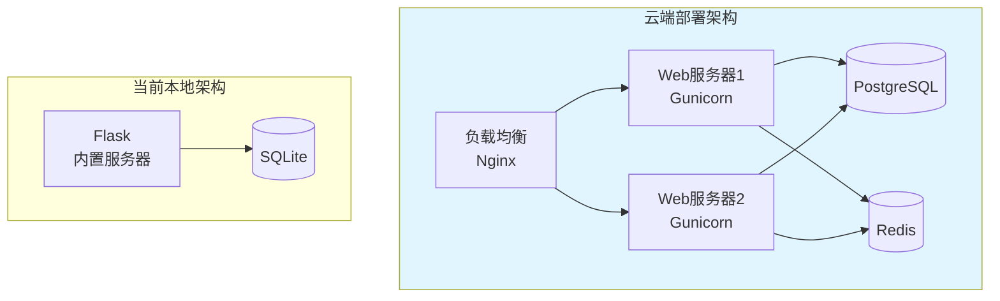

# 07-部署指南

> 言葉AI (Kotoba AI) 安装、配置与启动指南

---

## 7.1 环境要求

### 7.1.1 系统要求

| 项目 | 最低要求 | 推荐配置 |
|------|---------|----------|
| 操作系统 | Windows 10 / macOS 10.14 / Linux | Windows 11 / macOS 13 / Ubuntu 22.04 |
| Python | 3.8 | 3.11 |
| 内存 | 2GB | 4GB |
| 磁盘空间 | 100MB | 500MB |
| 浏览器 | Chrome 90+ / Firefox 90+ / Safari 14+ | 最新版 |

### 7.1.2 Python依赖

```
Flask==3.0.0
Werkzeug==3.0.1
click==8.1.7
itsdangerous==2.1.2
Jinja2==3.1.2
MarkupSafe==2.1.3
```

---

## 7.2 安装步骤

### 7.2.1 方式一：使用安装脚本（推荐）

#### macOS / Linux

```bash
# 1. 进入项目目录
cd kotoba-ai

# 2. 运行安装脚本
bash install.sh

# 3. 启动应用
python run.py
```

#### Windows

```powershell
# 1. 进入项目目录
cd kotoba-ai

# 2. 运行安装脚本
.\install.bat

# 3. 启动应用
python run.py
```

### 7.2.2 方式二：手动安装

```bash
# 1. 创建虚拟环境（推荐）
python -m venv venv

# 2. 激活虚拟环境
# macOS/Linux:
source venv/bin/activate
# Windows:
venv\Scripts\activate

# 3. 安装依赖
pip install -r src/backend/requirements.txt

# 4. 初始化数据库
python scripts/init_db.py

# 5. 启动应用
python run.py
```

---

## 7.3 配置说明

### 7.3.1 配置文件

创建 `src/backend/config.py`：

```python
import os

class Config:
    """应用配置"""
    
    # 数据库
    DATABASE_PATH = os.path.join(os.path.dirname(os.path.dirname(__file__)), 
                                  '..', 'data', 'japanese_learning.db')
    
    # 上传文件
    UPLOAD_FOLDER = os.path.join(os.path.dirname(os.path.dirname(__file__)), 
                                  '..', 'uploads')
    MAX_CONTENT_LENGTH = 16 * 1024 * 1024  # 16MB
    
    # 应用设置
    DEBUG = True
    SECRET_KEY = 'your-secret-key-here'  # 生产环境请修改
    
    # 分页设置
    DEFAULT_PAGE_SIZE = 20
    MAX_PAGE_SIZE = 100
    
    # 练习设置
    DAILY_PRACTICE_COUNT = 20
    
    @staticmethod
    def init_app(app):
        """初始化应用"""
        # 确保目录存在
        os.makedirs(os.path.dirname(Config.DATABASE_PATH), exist_ok=True)
        os.makedirs(Config.UPLOAD_FOLDER, exist_ok=True)
```

### 7.3.2 环境变量

```bash
# 可选的环境变量
export KOTOBA_DEBUG=true              # 调试模式
export KOTOBA_SECRET_KEY=your-key     # 密钥
export KOTOBA_PORT=5000               # 服务端口
export KOTOBA_HOST=127.0.0.1          # 绑定地址
```

---

## 7.4 启动应用

### 7.4.1 开发模式

```bash
# 使用Flask内置服务器（仅开发）
python run.py

# 或
python -m flask run --host=0.0.0.0 --port=5000
```

### 7.4.2 生产模式（预留）

```bash
# 使用Gunicorn（生产环境）
gunicorn -w 4 -b 127.0.0.1:5000 src.backend.app:app

# 使用uWSGI
uwsgi --http 127.0.0.1:5000 --wsgi-file src/backend/app.py --callable app
```

---

## 7.5 目录结构说明

```
kotoba-ai/
├── data/                           # 数据目录
│   ├── japanese_learning.db       # SQLite数据库文件 ⭐不要删除
│   └── backups/                   # 自动备份目录
│
├── uploads/                        # 上传文件（截图）
│   └── *.png/jpg                  # 您上传的截图
│
├── docs/                          # 设计文档
│   └── *.md                       # Markdown文档
│
├── src/                           # 源代码
│   ├── backend/                   # Flask后端
│   │   ├── app.py                # 主应用
│   │   ├── config.py             # 配置
│   │   ├── requirements.txt      # Python依赖
│   │   ├── models/               # 数据模型
│   │   ├── routes/               # API路由
│   │   ├── services/             # 业务逻辑
│   │   └── utils/                # 工具函数
│   │
│   └── frontend/                  # Web前端
│       ├── index.html            # 首页
│       ├── pages/                # 页面
│       └── static/               # 静态资源
│
├── scripts/                       # 工具脚本
│   ├── init_db.py                # 初始化数据库
│   ├── backup.py                 # 备份脚本
│   └── reset.py                  # 重置脚本
│
├── run.py                         # 启动脚本 ⭐用这个启动
├── install.sh                     # Mac/Linux安装
├── install.bat                    # Windows安装
└── requirements.txt               # 根目录依赖
```

---

## 7.6 常用操作

### 7.6.1 数据库备份

```bash
# 手动备份
python scripts/backup.py

# 或手动复制
cp data/japanese_learning.db backups/japanese_learning_$(date +%Y%m%d).db
```

### 7.6.2 数据库重置

```bash
# 警告：这将清空所有数据！
python scripts/reset.py

# 或手动删除后重新初始化
rm data/japanese_learning.db
python scripts/init_db.py
```

### 7.6.3 查看日志

```bash
# 实时查看日志
tail -f logs/app.log

# 查看错误日志
tail -f logs/error.log
```

---

## 7.7 故障排除

### 7.7.1 常见问题

#### Q1: 端口被占用

```bash
# 错误信息：Address already in use

# 解决：更换端口
python run.py --port=8080

# 或查找并关闭占用端口的进程
# macOS/Linux:
lsof -i :5000
kill -9 <PID>

# Windows:
netstat -ano | findstr :5000
taskkill /PID <PID> /F
```

#### Q2: 数据库权限错误

```bash
# 错误信息：unable to open database file

# 解决：检查目录权限
chmod 755 data/
chmod 644 data/japanese_learning.db
```

#### Q3: Python模块未找到

```bash
# 错误信息：No module named 'flask'

# 解决：重新安装依赖
pip install -r src/backend/requirements.txt

# 确认Python版本
python --version  # 需要3.8+
```

#### Q4: 静态文件加载失败

```bash
# 检查静态文件路径
# 确认 src/frontend/static/ 目录存在
ls -la src/frontend/static/
```

### 7.7.2 调试模式

```bash
# 启用调试模式（详细错误信息）
export KOTOBA_DEBUG=true
python run.py
```

---

## 7.8 升级维护

### 7.8.1 更新代码

```bash
# 拉取最新代码
git pull origin main

# 更新依赖
pip install -r src/backend/requirements.txt --upgrade

# 检查数据库迁移（如有）
python scripts/migrate.py
```

### 7.8.2 数据库迁移

```bash
# 查看当前版本
python scripts/db_version.py

# 执行迁移
python scripts/migrate.py upgrade
```

---

## 7.9 云端部署预留（未来）

### 7.9.1 部署架构



### 7.9.2 迁移路径

1. **数据库**: SQLite → PostgreSQL（使用导出/导入脚本）
2. **后端**: Flask → Gunicorn + Nginx
3. **缓存**: 添加Redis缓存层
4. **前端**: 静态文件 → CDN
5. **部署**: Docker容器化

### 7.9.3 Docker支持（预留）

```dockerfile
# Dockerfile（预留）
FROM python:3.11-slim

WORKDIR /app

COPY requirements.txt .
RUN pip install -r requirements.txt

COPY . .

EXPOSE 5000

CMD ["python", "run.py"]
```

```yaml
# docker-compose.yml（预留）
version: '3.8'
services:
  app:
    build: .
    ports:
      - "5000:5000"
    volumes:
      - ./data:/app/data
      - ./uploads:/app/uploads
```

---

## 7.10 安全检查清单

### 部署前检查

- [ ] 修改默认 SECRET_KEY
- [ ] 关闭 DEBUG 模式（生产环境）
- [ ] 配置正确的文件权限
- [ ] 启用数据库备份
- [ ] 检查防火墙设置
- [ ] 配置HTTPS（云端部署）

### 日常维护

- [ ] 定期备份数据库（建议每天）
- [ ] 检查磁盘空间
- [ ] 查看错误日志
- [ ] 更新依赖包（每月）

---

## 7.11 联系方式与支持

### 获取帮助

- 📖 查看文档：`docs/` 目录
- 🐛 提交问题：GitHub Issues
- 💬 功能建议：GitHub Discussions

### 贡献代码

1. Fork 项目
2. 创建分支 (`git checkout -b feature/AmazingFeature`)
3. 提交更改 (`git commit -m 'Add some AmazingFeature'`)
4. 推送分支 (`git push origin feature/AmazingFeature`)
5. 创建 Pull Request

---

**文档版本**: v1.0  
**创建日期**: 2026-02-11  
**最后更新**: 2026-02-11

---

**感谢使用 言葉AI (Kotoba AI)！** 🌸

祝您的日语学习之旅愉快！
